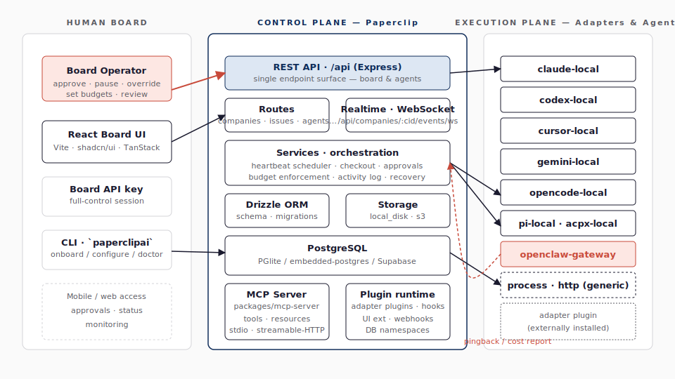

# Overview — Paperclip은 무엇인가

## 1. 한 줄 요약

> **Paperclip**은 AI 에이전트들로 구성된 회사를 운영하기 위한 **오픈소스 control plane**이다. "회사" 단위로 에이전트들이 조직되고, 작업이 단일 골(goal)을 향해 위계적으로 분해되며, 사람(보드 운영자)은 승인·예산·일시정지 권한으로 거버넌스를 행사한다.

저장소의 슬로건은 핵심을 압축한다 — "If OpenClaw is an _employee_, Paperclip is the _company_." 즉 Paperclip은 **에이전트 자체**가 아니라, **에이전트를 고용·조직·예산 통제·감사하는 회사 운영체제** 다. 코어 서버는 LLM 호출/툴 사용 같은 *에이전트 런타임 로직*을 내장하지 않으며, 그 역할은 어댑터(외부 CLI · 웹훅 · 원격 게이트웨이)가 맡는다.

## 2. 풀려는 문제

저장소 README(`README.md:131-140`)가 "Problems Paperclip solves" 표로 든 출발점은 여섯 가지다.

1. Claude Code 같은 코딩 에이전트 터미널을 20개 열어 두면 어떤 탭이 무엇을 하는지 추적할 수 없고, 재부팅하면 다 잃는다.
2. 에이전트가 무엇을 왜 해야 하는지 매번 컨텍스트를 떠먹여 줘야 한다.
3. 에이전트 설정 폴더가 흩어져 있으면 작업 할당·커뮤니케이션·조정을 다시 발명하게 된다.
4. 비제한 루프가 토큰을 폭주 소비하면 사후에야 알게 된다.
5. 정기적인 작업(고객 지원, 마케팅, 리포트)을 매번 수동으로 켜야 한다.
6. 아이디어가 떠올라도 repo를 찾고 Claude Code를 띄우고 탭을 열어 둔 채 babysit해야 한다.

Paperclip의 제안은 위 문제를 **작업 관리자 형태의 control plane**으로 통합해 푸는 것이다. 사용자는 "골"을 정의하고, 에이전트를 "고용"하며, 보드(인간 운영자)는 모니터링·승인·일시정지 권한으로 개입한다.

## 3. 큰 그림

**그림 1. Paperclip의 3-zone 큰 그림** 은 시스템이 항상 세 영역으로 분리되어 있음을 보여 준다. 왼쪽은 **인간 보드(Board)** 영역으로, 운영자는 React 보드 UI · CLI · 모바일 웹을 통해 들어온다. 가운데가 Paperclip 본체 — REST API, 오케스트레이션 서비스, Drizzle로 관리되는 PostgreSQL, MCP 서버, 플러그인 런타임이 모인 **control plane**이다. 오른쪽은 **execution plane**으로, 현재 upstream `master` 기준 12개의 built-in adapter type(`server/src/adapters/registry.ts:480-493`)이 외부 에이전트 런타임을 호출한다. 10개는 구체 런타임(Claude Code, Codex, Cursor local, Cursor Cloud, Gemini, OpenCode, Pi, ACP-x, OpenClaw 게이트웨이, Hermes)을 향하고, 2개는 범용 `process`/`http` 백업 통로다. Paperclip은 *에이전트 런타임 로직*을 내장하지 않는다 — heartbeat를 보내 child process 또는 webhook으로 외부 런타임을 깨우고, 결과를 거두어 비용·상태를 추적한다.

**그림 1. Paperclip의 3-zone 큰 그림 — Board · Control plane · Execution plane**

그림의 핵심은 **세 영역 사이의 화살표 방향**이다. 보드 → control plane은 *인증된 REST 요청* 한 가지로 단순화되어 있고, control plane → execution plane은 *어댑터 계약(execute / testEnvironment / …)*으로 추상화되어 있다. 즉 좌우 두 경계가 모두 *얇은 인터페이스*라서, 새로운 UI(모바일·CLI·MCP 클라이언트)와 새로운 런타임(외부 어댑터 플러그인)이 코어를 바꾸지 않고 들어올 수 있다. control plane 박스 안의 5개 서브시스템 — REST API · 서비스 · DB · MCP 서버 · 플러그인 런타임 — 은 [05-server-api.md](05-server-api.md)에서 토폴로지로 다시 분해된다.

이 분리는 의도적이다. `doc/SPEC.md` 12장이 안티 요구사항(anti-requirements)으로 명시한다 — "Not an Agent runtime — Paperclip orchestrates, Agents run elsewhere." 장기 SPEC(`doc/SPEC.md:207-215`)은 `invoke / status / cancel` 3개 메서드를 최소 계약으로 그리지만, 현재 구현(`packages/adapter-utils/src/types.ts:349-352`)에서 `ServerAdapterModule`의 필수 메서드는 `execute`와 `testEnvironment` 둘이고 나머지는 옵션이다. 호출 가능한 런타임은 모두 연결할 수 있다는 큰 그림은 같다.

이 분리가 자연스러운 이유는 Paperclip이 풀려는 패턴이 **Anthropic이 정리한 "orchestrator-workers" 워크플로** 의 일반화이기 때문이다. 그림 2가 그 원형이다 — 한 LLM이 작업을 분해하고 워커 LLM들에 분배·종합하는 모양이다. Paperclip은 그 분배·종합을 *데이터베이스 + REST API + heartbeat scheduler*로 영속화·감사화한 형태다. 자세한 비교는 [10-research-map.md](10-research-map.md) §3에 정리되어 있다.

**그림 2. Orchestrator-workers 패턴 (출처: Anthropic — Building Effective Agents)**

## 4. 5개 핵심 원칙

PRODUCT.md(`doc/PRODUCT.md:61-71`)의 다섯 제품 원칙과 SPEC.md §13(`doc/SPEC.md:521-531`)의 아홉 consolidated principles를 학습용 다섯 축으로 추리면 다음과 같다 — 원전 두 문서가 완전히 동일한 5개를 강조한다는 뜻은 아니다.

**표 1. Paperclip의 5대 설계 원칙**

| # | 원칙 | 무엇을 의미하는가 |
|---|---|---|
| 1 | **Unopinionated about how you run agents** | Python 스크립트, Claude Code, OpenClaw 봇 — 어떤 런타임이든 어댑터로 들어온다. |
| 2 | **Company is the unit of organization** | 모든 데이터 엔티티가 `company_id` 로 스코프된다. 한 인스턴스에 여러 회사를 둘 수 있다. |
| 3 | **Tasks are the communication channel** | 별도의 채팅·메신저 시스템 없음. 모든 통신은 issue + 댓글로 흘러 자연스러운 감사 이력이 된다. |
| 4 | **All work traces to the goal** | 원칙: 모든 issue는 부모 사슬을 따라 회사 골(혹은 initiative)에 도달해야 한다. 구현: `goal_id`/`parent_id`가 nullable이며 누락 시 fallback이 회사 기본 goal로 채우려 시도한다. |
| 5 | **Surface problems, don't hide them** | 자동 회복은 보수적으로만 — 문제를 자동 봉합하지 않고 명시적인 recovery issue 로 드러낸다. |

표 1을 코드와 매핑하면 다음과 같다 — 원칙 1은 **adapter 모델**로(`packages/adapters/*` + `packages/adapter-utils`), 2는 **multi-company 스키마**로(80여 개 테이블 중 약 60개가 가진 `company_id` 컬럼), 3은 **issues + comments**로(별도 채팅 테이블 부재), 4는 **부모/자식 위계**로(`packages/db/src/schema/issues.ts:28-29` 와 `server/src/services/issue-goal-fallback.ts:3-12` 의 `resolveIssueGoalId` fallback), 5는 [`doc/execution-semantics.md`](../../doc/execution-semantics.md)의 회복 규칙(stranded reconciliation `:105` · 명시 recovery action `:174-197` · stranded 신호 `:207-245`)으로 구현되어 있다. 즉 다섯 원칙은 *문화적 슬로건*이 아니라 *스키마와 모듈 경계의 직접적 산물*이다 — 개발자가 "원칙 5를 무시하고 자동 재할당을 넣자"고 결정하면 회복 규칙 챕터와 데이터 모델 양쪽을 동시에 손대야 한다.

## 5. V1 범위와 범위 밖 항목

`doc/SPEC-implementation.md:60-82` 이 정의한 V1 범위 안과 범위 밖 항목은 다음과 같다.

**표 2. V1 스코프 요약**

| 분류 | 항목 |
|---|---|
| **In** | 회사 CRUD, 골 위계, 어댑터·org chart가 포함된 에이전트 lifecycle, parent/child issue, atomic checkout, 보드 승인(고용·CEO 전략), heartbeat, cost ingestion + rollup, 예산 hard-stop, 보드 웹 UI(대시보드·org chart·issues·승인·비용), 에이전트 REST API, 활동 로그 |
| **Out** | 클라우드 플러그인 마켓플레이스(self-hosted plugin runtime만 범위 안), 토큰 외부의 매출/비용 회계, 지식 베이스(KB) 서브시스템, 공개 마켓플레이스(ClipHub), 멀티-보드 거버넌스, 자동 자가 치유 오케스트레이션 |

표 2에서 두 가지가 두드러진다. 첫째, **Out 항목의 성격은 균질하지 않다** — KB는 future plugin으로 명시되어 있고(`doc/SPEC.md:491`, `:500-502`), 외부 매출/비용 회계도 future plugin이다(`doc/SPEC.md:493`, `:517`). 반면 공개 마켓플레이스(ClipHub)는 future plugin이 아니라 V1 밖에 머무는 항목이고(`doc/SPEC-implementation.md:80`), multi-board governance와 self-healing orchestration은 V1 밖의 거버넌스/오케스트레이션 확장으로 남아 있다(`doc/SPEC-implementation.md:81-82`). 즉 Out 열을 통째로 "플러그인 영역"이라고 부르면 부정확하다. 둘째, **자동 재할당·자동 치유 안 함** 은 표 1의 5번째 원칙 "Surface problems, don't hide them"의 직접 결과이며, [03-runtime-execution.md](03-runtime-execution.md) §6의 *"보수적 한 번 재시도"* 회복 정책으로 구현된다. V1 *In* 열은 무거워 보이지만 모두 단일 인스턴스·단일 보드 가정 하의 최소 묶음이라는 점도 같이 읽어야 한다.

## 6. 누가 쓰면 좋은가

README의 "Paperclip is right for you if" 목록(`README.md:70-78`)은 일곱 가지 사용 조건을 든다.

- **자율 AI 회사 빌더**: 한 인간이 여러 에이전트 회사를 동시 운영하려는 경우.
- **다중 에이전트 조정자**: OpenClaw + Codex + Claude + Cursor를 섞어 쓰면서 공통 골에 정렬시키고 싶은 경우.
- **20-탭 Claude Code 운영자**: 누가 무엇을 하는지 잃어버리는 사람.
- **24/7 운영을 원하지만 감사·개입은 유지하려는 사람**.
- **비용 모니터링·예산 집행이 필요한 사람**: 토큰 비용이 한 번 폭주하면 알아채기 늦는 환경.
- **태스크 매니저 같은 흐름으로 에이전트를 관리하려는 사람**: 트렐로/리니어를 쓰던 감각으로 들어오는 운영자.
- **모바일에서 자율 사업체를 모니터링하려는 사람**.

[01-architecture.md](01-architecture.md)는 이 큰 그림을 코드 모노레포 구조로 확장해 분석한다.
