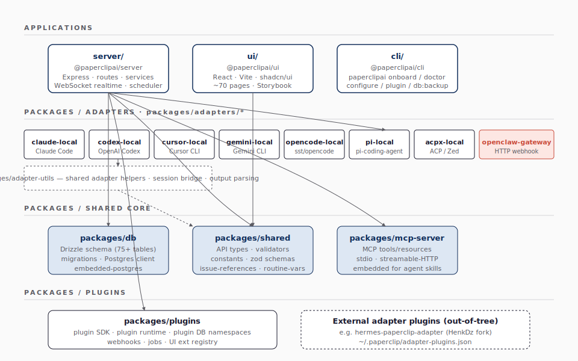

# Architecture — 모노레포 구조

## 1. 모노레포 한눈에

Paperclip은 **pnpm workspace** 모노레포다. 루트의 `pnpm-workspace.yaml` 이 워크스페이스를 선언하고, 각 패키지는 `workspace:*` 프로토콜로 서로를 참조한다. 그림 1-1은 패키지 지도와 의존 방향을 한 페이지로 보여 준다. 의존 화살표는 "위쪽 패키지가 아래쪽 패키지를 import 한다"를 의미한다.

**그림 1-1. pnpm 모노레포 패키지 지도와 의존 방향**



그림 1-1의 구조는 세 계층으로 나뉜다. (1) 최상위 **애플리케이션** — `server/`, `ui/`, `cli/`. (2) **공유 코어** — `packages/db`, `packages/shared`, `packages/mcp-server`. (3) **확장점** — `packages/adapters/*`, `packages/adapter-utils`, `packages/plugins`. 외부에는 사용자가 설치하는 **어댑터 플러그인**이 점선으로 그려져 있는데, 이는 코어를 수정하지 않고 새로운 에이전트 런타임을 끼워 넣는 통로다. 의존이 *위에서 아래로만* 흐른다는 점도 그림에서 확인할 수 있다 — `packages/shared`가 `server/`를 import 하지 않듯, 하위 패키지는 상위 패키지를 참조하지 않으므로 모노레포 빌드를 위상 정렬할 수 있고, 하위에서 발생한 타입 변경이 상위로 전파된다.

## 2. 패키지별 책임 — 표 한 장

**표 1. 패키지별 역할과 주요 런타임 의존**

| 패키지 | 역할 | 주요 export | 의존 |
|---|---|---|---|
| `server/` | Express REST API + 오케스트레이션 호스트 | `app.ts`, `routes/*`, `services/*`, `realtime/*` | db · shared · adapter-utils · plugin-sdk · 9개 adapter workspace · hermes-paperclip-adapter (npm) (`server/package.json:47-70`) |
| `ui/` | React + Vite 보드 UI | 페이지·컴포넌트·api 클라이언트 | shared · 9개 adapter workspace · adapter-utils · hermes-paperclip-adapter (`ui/package.json:37-54`) — 어댑터 UI entry 동적 임포트용 |
| `cli/` | `paperclipai` 단일 진입 CLI | `src/index.ts` (commands: onboard · doctor · run · plugin · db:backup) | shared · server · db · adapter-utils · 9개 adapter workspace (`cli/package.json:40-57`) — in-process boot |
| `packages/db` | Drizzle 스키마 + 마이그레이션 | `schema/*.ts` (80+ 테이블), `client.ts` | shared · drizzle-orm · embedded-postgres · postgres (`packages/db/package.json:46-50`) |
| `packages/shared` | 타입·검증·상수 | `api.ts`, `adapter-type.ts`, zod 검증 | (no internal) |
| `packages/mcp-server` | Paperclip 공식 MCP 서버 | tools / resources | shared · `@modelcontextprotocol/sdk` (REST API 호출, DB 직접 의존 없음) (`packages/mcp-server/package.json:45-49`) |
| `packages/adapters/*` | 패키지형 내장 어댑터 9개 | 각자 `src/index.ts`, `src/server`, `src/cli`, `src/ui` | adapter-utils |
| `packages/adapter-utils` | 어댑터 공통 도우미 | session bridge, output 파서 | (no runtime internal) (`packages/adapter-utils/package.json:42-45`) |
| `packages/plugins/sdk` | 플러그인 SDK | manifest, lifecycle hook, UI 브릿지 | shared (`packages/plugins/sdk/package.json:110-113`) — *플러그인 host runtime은 `server/src/services/plugin-*` 에 있고, `packages/plugins/{examples,plugin-llm-wiki,sandbox-providers/*}` 는 별도 워크스페이스* |

표 1 에서 의도적으로 드러나는 패턴은 *얇은 공유 레이어 + 두꺼운 애플리케이션 레이어* 다. `packages/shared` 가 `(no internal)` 의존인 것은, 모든 패키지가 공유하는 타입/검증/상수를 한 곳에 모아 *순환 의존* 을 원천 차단하려는 결정의 결과다. 반대로 `server/` 가 거의 모든 패키지에 의존하는 것은 server 가 control plane 의 *조립 지점* 이기 때문이다. `AGENTS.md` 의 **5장 Core Engineering Rules** 가 이 분할을 강제한다 — 스키마/계약을 바꾸면 `db / shared / server / ui` 의 4개 레이어가 동기화돼야 한다는 것이 1순위 규칙이며, 표 1 의 의존 열이 그 동기화 순서(아래에서 위로)를 그대로 가리킨다.

## 3. built-in 어댑터 타입과 패키지형 어댑터

현재 upstream `master` 의 built-in adapter type은 12개다(`server/src/adapters/registry.ts:480-493`). 패키지형 9종 — `acpx-local`, `claude-local`, `codex-local`, `cursor-cloud`, `cursor-local`, `gemini-local`, `opencode-local`, `pi-local`, `openclaw-gateway` — 은 `packages/adapters/` 아래의 워크스페이스 패키지(`server/package.json:47-55`)로 들어 있고, `hermes_local` 은 `hermes-paperclip-adapter` npm 의존성을 `server/src/adapters/registry.ts:117-127` 에서 정적으로 등록한다. 나머지 `process` 와 `http` 는 새 런타임을 임시로 붙일 때 쓰는 범용 generic 통로다. 아래 코드 1은 패키지형 어댑터 디렉터리의 표준 트리다.

**코드 1. 어댑터 패키지의 표준 디렉터리 구조**

```bash
packages/adapters/<name>/
├── src/
│   ├── index.ts          # 메타데이터 + 타입
│   ├── server/index.ts   # execute / testEnvironment + 런타임 실행·검증 로직
│   ├── ui/index.ts       # 보드 UI 가 동적 임포트하는 설정 폼/뷰
│   └── cli/index.ts      # paperclipai CLI 가 임포트하는 helper
├── package.json
└── tsconfig.json
```

이 4개 진입점(`. / server / ui / cli`)은 `package.json` 의 `exports` 필드로 외부에 노출된다. **즉 어댑터는 동일한 npm 패키지가 server·ui·cli 에 각자 다른 모듈을 제공** 하는 식으로 짜여 있다. 이렇게 하면 서버는 실행 로직만, UI 는 설정 폼만 가져갈 수 있어 트리 셰이킹·번들 크기 면에서 유리하다. 장기 SPEC(`doc/SPEC.md:207-215`)은 `invoke/status/cancel` 3개 메서드를 최소 계약으로 그리지만, 현재 구현의 `ServerAdapterModule`(`packages/adapter-utils/src/types.ts:349-352`)이 필수로 두는 메서드는 `execute` 와 `testEnvironment` 두 개다.

## 4. 단일 origin dev 모드

개발 단계에서는 Vite 의 **middleware mode** 가 핵심이다. `pnpm dev` 는 Express 서버를 띄우면서 동시에 `vite.middlewareMode` 로 SPA 자산을 *같은 origin* 에서 서빙한다. 기본 요청 포트는 `3100` 이며, 점유 중이면 `detect-port`(`server/package.json:64`) 가 다음 사용 가능한 포트를 골라 그쪽으로 올린다 — UI 도 선택된 API 포트에 same-origin 으로 따라간다. 이 결과 dev 모드에서는 CORS 설정이 필요 없고, 보드 UI 의 `fetch('/api/...')` 가 그대로 같은 origin 으로 떨어진다. 코드 2 가 dev 워크플로의 4가지 모드를 한 줄씩 보여 준다 — 일상은 `pnpm dev` 하나로 충분하지만, 서버/UI 를 따로 디버깅해야 할 때를 위해 분리 모드도 준비되어 있다.

**코드 2. 개발 워크플로 — 4가지 dev 명령**

```bash
pnpm dev               # API + UI 단일 origin (기본 3100, 점유 시 detect-port가 조정)
pnpm dev:server        # API 만 watch 모드
pnpm dev:ui            # Vite UI 만 (별도 origin)
pnpm storybook         # ui/ 의 컴포넌트 카탈로그 (port 6006)
```

또 하나의 트릭은 **`scripts/dev-runner.ts`** 다. 같은 저장소·같은 인스턴스에 대해 `pnpm dev` 를 두 번째로 호출해도 기존 dev 러너를 재사용해 중복 실행을 막는다. `pnpm dev:list / dev:stop` 으로 관리할 수 있다.

## 5. 빌드·테스트 토폴로지

빌드의 표준 진입점은 루트 `pnpm build` 다(`package.json:16`). 이 스크립트가 먼저 `preflight:workspace-links` 단계로 워크스페이스 심볼릭 링크 정합을 점검하고, 이어서 `pnpm -r build` 로 모든 워크스페이스를 위상 정렬해 빌드한다. `pnpm -r build` 만 직접 실행하면 preflight 단계는 건너뛴다는 점에 주의해야 한다. 테스트는 두 갈래다.

- **단위/통합**: Vitest 3.x — `pnpm test` (= `pnpm test:run` = `node scripts/run-vitest-stable.mjs`). `general` 모드와 `serialized` 모드가 분리되어 있다.
- **E2E / 릴리스 스모크**: Playwright — `pnpm test:e2e`, `pnpm test:release-smoke`. 변경이 UI 흐름을 건드릴 때만 켠다.

`package.json` 의 `engines.node = ">=20"` 이 강제하는 Node 20 LTS 위에서 동작한다. **표 2** 가 이를 정리한다.

**표 2. 표준 명령 한눈에**

| 명령 | 무엇을 하는가 |
|---|---|
| `pnpm install` | 의존성 + workspace 링크 |
| `pnpm dev` | watch 모드 dev (API+UI 단일 origin) |
| `pnpm dev:once` | 한 번만 boot, 마이그레이션 자동 적용 |
| `pnpm db:generate` | Drizzle 스키마 → SQL 마이그레이션 |
| `pnpm db:migrate` | 마이그레이션 적용 |
| `pnpm test` | Vitest 안정 러너 |
| `pnpm test:e2e` | Playwright E2E |
| `pnpm typecheck` | preflight + 모든 패키지 typecheck |
| `pnpm build` | preflight + 전체 위상 정렬 빌드 (직접 `pnpm -r build` 는 preflight 생략) |
| `pnpm storybook` | UI 컴포넌트 카탈로그 |
| `pnpm paperclipai onboard` | 인터랙티브 초기 설정 |
| `pnpm paperclipai doctor` | 환경 점검 |

표 2 의 명령은 *세 단계의 신뢰성 사다리* 로 묶인다 — `dev`/`dev:once` 가 일상의 빠른 루프, `db:generate`/`db:migrate` 가 스키마 변경의 안전 게이트, `test`/`test:e2e`/`-r typecheck`/`-r build` 가 PR 전 검증 라인이다. 첫 사용자는 `paperclipai onboard` → `pnpm dev` → `pnpm test` 세 줄만으로 한 회사의 한 회차를 돌려 볼 수 있다.

## 6. 두 종류의 인스턴스 디렉터리

런타임 데이터는 **저장소 밖** 의 `~/.paperclip/instances/<instance>/` 에 산다. 코드 3 은 한 인스턴스의 **핵심 경로만** 추린 것이고, 전체 레이아웃(예: `data/backups/`, `logs/`, `workspaces/<agent-id>/`, `projects/`, `companies/<company-id>/codex-home/` 등)은 `doc/DEVELOPING.md` 의 인스턴스 섹션을 참고해야 한다. 코드 저장소와 사용자 데이터가 깨끗이 분리되어 있어, 같은 머신에서 여러 인스턴스를 병렬로 띄울 수 있다.

**코드 3. 인스턴스 디렉터리 레이아웃 (`~/.paperclip/instances/<instance>/`)**

```text
~/.paperclip/
└── instances/
    └── default/
        ├── config.json           # 모드, secret 키 경로 등
        ├── db/                   # embedded PostgreSQL 데이터 디렉터리
        ├── data/storage/         # local_disk 첨부/work product
        └── secrets/master.key    # local_encrypted secrets 마스터 키
```

이는 두 가지를 가능케 한다. (1) 코드 저장소가 사용자 데이터를 깨끗이 분리한다. (2) 한 머신에서 여러 인스턴스를 병렬로 운영할 수 있다 — `PAPERCLIP_HOME` 또는 `PAPERCLIP_INSTANCE_ID` 로 인스턴스 디렉터리를 분리하면, 포트는 detect-port 가 사용 가능한 값으로 알아서 조정한다.

[02-data-model.md](02-data-model.md)는 이 패키지 구조 위의 데이터 모델 — Drizzle 스키마 80+ 테이블 — 을 핵심 ER 그림으로 분석한다.
