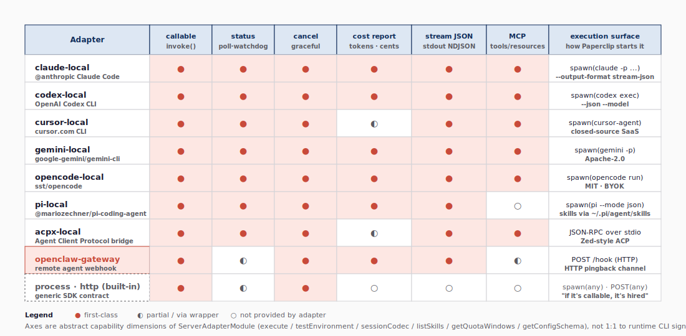
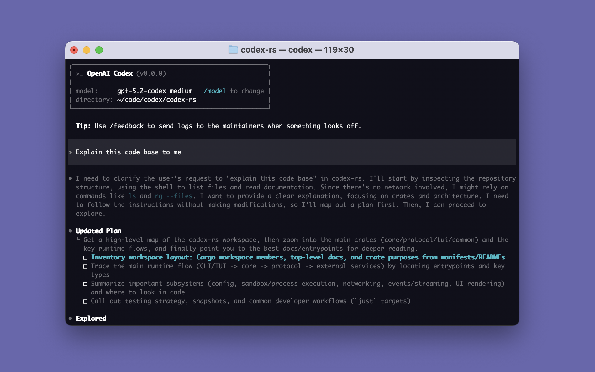
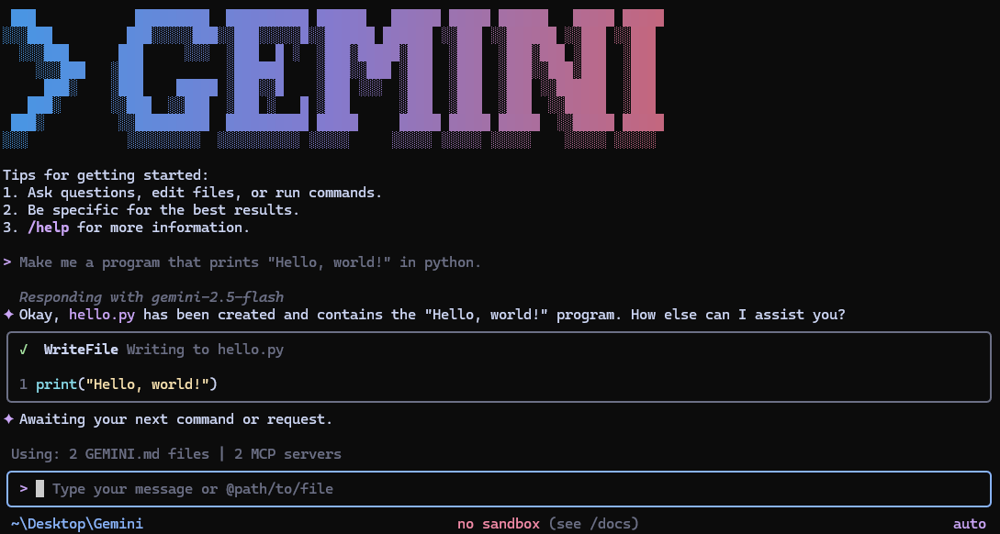

# Adapters & Skills — built-in 어댑터 + Paperclip Skill

## 1. "호출 가능한 것은 모두 채용된다"

Paperclip README의 슬로건 — *"If it can receive a heartbeat, it's hired."* — 은 어댑터 시스템의 핵심 약속이다. 어댑터는 Paperclip control plane과 외부 에이전트 런타임 사이의 좁은 통로다.

그림 7 이 런타임 전용 built-in 어댑터 10개와 범용 어댑터 2개(`process` · `http`)를 능력 축으로 정렬한다(`server/src/adapters/registry.ts:480-493`). 각 축은 `ServerAdapterModule`(`packages/adapter-utils/src/types.ts:349-431`)의 실제 필드 — 핵심 실행·모델·옵션 필드(`execute`, `testEnvironment`, `listSkills`/`syncSkills`, `sessionCodec`, `supportsLocalAgentJwt`, `getQuotaWindows`, `detectModel`, `getConfigSchema` 등은 `:349-396`)와 capability flags(`supportsInstructionsBundle`, `instructionsPathKey`, `requiresMaterializedRuntimeSkills`, `getRuntimeCommandSpec` 등은 `:407-431`) — 에 대응한다.

**그림 7. 어댑터 능력 매트릭스 — 런타임 전용 built-in 10개 + 범용 process/http × ServerAdapterModule 필드**



전반적으로 주요 local coding adapters(`claude-local`, `codex-local`, `cursor-local`, `gemini-local`, `opencode-local`, `pi-local`)는 `execute` + `testEnvironment` 외에 `listSkills`/`syncSkills`, `sessionCodec`, `models`/`listModels`, `agentConfigurationDoc` 같은 핵심 선택 필드를 대체로 제공한다. 다만 모든 선택 필드를 일률적으로 채우지는 않는다 — `getQuotaWindows`는 현재 `claude-local`과 `codex-local`만 제공하고, `getConfigSchema`는 `acpx-local`과 `cursor-cloud`가 제공하며, `detectModel`은 현재 upstream `master`에서는 정적으로 등록된 `hermes-paperclip-adapter` 경로에서 들어온다(`server/src/adapters/registry.ts:116-123, 456-465`). `openclaw-gateway`는 HTTP 브리지라 일부 lifecycle이 제한적이고, 회색 점선의 generic `process · http`는 최소 계약 — `execute` + `testEnvironment` — 만 채운 백업 통로다. 다이어그램의 `status`/`cancel`/`MCP` 라벨은 **adapter module의 추상 능력 축**이며, 런타임 차원의 정확한 시그널 매핑은 어댑터 코드에 따라 다르다는 점을 legend에서 명시한다. 그림 7은 행 기준으로 *어댑터별 능력 프로파일*, 열 기준으로 *능력별 채택률*을 보여 준다. 행이 빈 칸이 많은 어댑터는 *생태계 미성숙*의 신호이고, 열이 빈 칸이 많은 능력은 *Paperclip 코어가 아직 강제하지 않는다*는 신호다. 새 어댑터 플러그인은 그림 7의 첫 두 열(`execute` · `testEnvironment`)만 채워도 시스템에 들어올 수 있으며, 나머지 능력은 점진적으로 추가할 수 있다.

## 2. built-in 어댑터 요약

각 어댑터의 호출 시그니처와 라이선스/과금 성격은 다음과 같다(자세한 내용 + 인용은 [docs/research/04-headless-coding-agents.md](../research/04-headless-coding-agents.md)).

**표 1. 런타임 전용 built-in 10종 + 범용 2종**

| 어댑터 | 대상 런타임 | 호출 형태 | MCP | 라이선스 / 요금 |
|---|---|---|---|---|
| `claude-local` | Anthropic Claude Code | `claude -p --output-format stream-json` | ● | proprietary CLI · API or Claude Pro/Max |
| `codex-local` | OpenAI Codex CLI | `codex exec --json --model …` | ● | Apache-2.0 · ChatGPT plan or API |
| `cursor-local` | Cursor CLI / agent | `cursor-agent …` | ● | closed-source · BYOK |
| `cursor-cloud` | Cursor Cloud Agent (Cursor SDK / Cloud Agents API v1) | managed remote agent | ◐ | proprietary · BYOK |
| `gemini-local` | Google Gemini CLI | `gemini --output-format stream-json --prompt …` | ● | Apache-2.0 · free Google login or API |
| `opencode-local` | sst/opencode | `opencode run …` | ● | MIT · BYOK |
| `pi-local` | mariozechner/pi-coding-agent | `pi --mode json …` | ✕ (skills 디렉터리) | MIT · BYOK · Claude Pro · ChatGPT Plus 토큰도 활용 |
| `acpx-local` | Agent Client Protocol bridge | JSON-RPC stdio | ● | open standard (Zed) |
| `openclaw-gateway` | OpenClaw remote agents | `POST /hook` HTTP webhook | ◐ | open-source remote agent runtime |
| `hermes_local` | Hermes local process | `hermes-paperclip-adapter` server module | ● | upstream `master`에서는 정적 의존성, externalize 브랜치에서는 플러그인 전용 |
| `process` (generic) | 임의 child process | `spawn(any)` | ✕ | — |
| `http` (generic) | 임의 webhook | `POST(any)` | ✕ | — |

표 1의 마지막 두 행(`process` · `http`)이 중요하다 — Paperclip의 *"호출 가능한 것은 모두 채용된다"* 슬로건이 단순한 문구가 아니라 코드에 포함된 백업 어댑터라는 증거다. 외부 어댑터 플러그인이 막힐 때, 또는 새 런타임이 등장해 전용 어댑터가 아직 없을 때, 사용자는 범용 어댑터 두 개 중 하나로 일단 회사를 시작할 수 있다. 표의 라이선스 열도 운영적으로 의미 있다 — 폐쇄형(Cursor)부터 Apache-2.0(Codex/Gemini), MIT(OpenCode/Pi), 표준 명세(ACP), 오픈 런타임(OpenClaw), 별도 npm 패키지로 들어오는 Hermes까지 여러 배포·과금 모델이 한 회사 안에 공존할 수 있다.

**그림 4-1\~4**는 각 런타임의 공식 자료에서 가져온 이미지로, *어댑터 한 줄 뒤에 어떤 도구가 실제로 돌아가는지*를 보여 준다.

**그림 4-1. OpenAI Codex CLI 스플래시 (출처: github.com/openai/codex)**



**그림 4-2. Google Gemini CLI 동작 화면 (출처: github.com/google-gemini/gemini-cli)**



**그림 4-3. sst/opencode TUI (출처: github.com/sst/opencode)**


**그림 4-4. Pi coding agent 트리 뷰 (출처: github.com/badlogic/pi-mono)**


## 3. 어댑터 폴더의 4개 진입점

`packages/adapters/<name>/package.json` 의 `exports` 필드는 모든 어댑터가 동일한 4개 진입점을 노출함을 강제한다. **코드 1** 이 그 표준 export 맵이다 — 같은 npm 패키지가 server·ui·cli 에 *각자 다른 모듈* 을 제공하는 구조이며, 이렇게 해야 server 빌드는 React 폼을, UI 빌드는 spawn 로직을 *불러오지 않게* 된다.

**코드 1. 어댑터 패키지의 표준 `exports` 맵 (4개 진입점)**

```json
{
  "exports": {
    ".":        "./src/index.ts",     // 메타데이터 + 타입
    "./server": "./src/server/index.ts",  // execute / testEnvironment + spawn 로직
    "./ui":     "./src/ui/index.ts",      // 보드 UI 가 동적 임포트하는 설정 폼
    "./cli":    "./src/cli/index.ts"      // paperclipai CLI helper
  }
}
```

이 분할은 코드 위생과 번들 크기 모두에 좋다. 서버는 spawn 로직만, UI 는 React 폼만, CLI 는 onboarding helper 만 가져간다. **표 2** 가 각 진입점의 책임을 정리한다.

**표 2. 어댑터 4개 진입점의 책임**

| 진입점 | 임포트하는 쪽 | 무엇을 export 하나 |
|---|---|---|
| `.` | server / ui / cli 모두 | `id`, `displayName`, `defaultRuntimeConfig`, `configSchema`, type-safe 메타 |
| `./server` | server | `execute / testEnvironment` 구현 + optional capability/lifecycle hook(`listSkills`, `syncSkills`, `sessionCodec`, `models`, `getQuotaWindows`, `detectModel`, …), child_process spawn, output 파서, cost 추출 |
| `./ui` | ui | React 컴포넌트 — 어댑터 설정 폼, run transcript 뷰, 진단 뷰 |
| `./cli` | cli | `paperclipai onboard` 가 호출하는 helper (env 점검, 인증 안내) |

표 2 의 4개 진입점 분리는 *기여자 진입* 관점에서도 의미가 크다 — UI 만 손대고 싶은 기여자는 `./ui` 만 보면 되고, 어댑터 spawn 로직만 디버깅하고 싶다면 `./server` 만 들여다보면 된다. `cursor-local` 같은 SaaS 어댑터는 BYOK 안내·로그인 토큰 점검 로직을 `./cli` 에 둔다. `acpx-local` 은 [Agent Client Protocol](https://agentclientprotocol.com/) 다리이기에, `./server` 가 JSON-RPC stdio 디스패처를 들고 있다.

## 4. 외부 어댑터 플러그인 — 코어 미수정 확장

리포지터리 상단의 `adapter-plugin.md` 가 묘사하는 외부 어댑터 플러그인 흐름은 다음과 같다. **코드 2** 가 외부 어댑터를 코어 수정 없이 *설치 → 등록 → 활성화 → 사용* 4단계로 들이는 표준 절차다 — 1단계는 CLI 한 줄, 2\~4단계는 보드 UI 안에서 마우스 클릭으로 끝난다.

**코드 2. 외부 어댑터 플러그인 lifecycle — 4단계**

```bash
# 1) 어댑터 플러그인을 설치
pnpm paperclipai plugin install <package-or-path>

# 2) 플러그인이 ~/.paperclip/adapter-plugins.json 에 등록
# 3) 보드 UI > Adapter manager 에서 활성화
# 4) 새 에이전트 만들 때 adapter_type=<plugin-id>
```

> **외부화 상태.** 현재 upstream `master`의 `server/src/adapters/registry.ts:106\~117`은 **`hermes-paperclip-adapter`를 정적 import**하고, 같은 파일의 built-in 등록 배열에 `hermesLocalAdapter`를 포함한다. 즉 메인 라인은 아직 Hermes를 코어 의존성으로 포함한다. 반면 HenkDz 포크의 `feat/externalize-hermes-adapter` 브랜치는 *"코어에는 hermes 의존성도 등록도 두지 않고, 플러그인으로만 도입"* 하는 외부화 사례다. 이 차이를 분리해서 읽어야 adapter plugin 설계가 어디까지 구현됐고, 어디부터 브랜치별 정책인지 혼동하지 않는다.

### 4.1 Sandbox provider plugins — 실행 환경 driver의 외부화

어댑터가 *어떻게 깨우느냐* 라면, sandbox provider plugin은 *어디서 깨우느냐* 다. 현재 `packages/plugins/sandbox-providers/` 에는 4종이 들어 있다(`e2b`, `cloudflare`, `daytona`, `exe-dev`). 모두 plugin manifest의 `environment.drivers.register` capability와 `kind: "sandbox_provider"` 로 실행 환경 driver를 등록해, 에이전트가 로컬·E2B cloud sandbox·Cloudflare sandbox·Daytona sandbox/workspace·exe.dev VM 어디서든 같은 어댑터로 실행되게 한다. 어댑터 분류(런타임 호출 통로) 와 sandbox provider 분류(실행 환경 격리) 가 직교하므로, 한 회사 안에서 *`claude-local` 어댑터를 Cloudflare sandbox에서 실행* 같은 조합이 가능하다.

## 5. Paperclip Skill — 에이전트가 Paperclip을 다루는 방법

어댑터 옆에 Paperclip 이 *에이전트 안쪽으로* 보내는 통로가 있다 — `skills/paperclip/` 디렉터리에 들어 있는 **Paperclip SKILL.md**. SKILL.md 는 Claude Code · Codex 등이 채택한 skill 표준 포맷의 마크다운 파일이며, 에이전트에게 다음을 가르친다.

- 작업(issue) CRUD — `paperclipai issues list / view / update`
- 진척 보고 — `paperclipai issues update <id> --status in_progress`
- 회사 컨텍스트 읽기 — 골 트리, org chart, 현재 상태
- 비용 보고 — 토큰 / API 사용량 기록
- 인터-에이전트 통신 규칙 — cross-team 작업 수락·거절 프로토콜

`skills/` 폴더에는 7개 추가 스킬이 같이 산다. 코드 3 이 그 디렉터리 트리이며, 각 스킬은 *어떤 상황에서* 에이전트가 어떻게 행동해야 하는지를 마크다운으로 가르친다.

**코드 3. `skills/` 디렉터리 — Paperclip 베이스 + 7개 보조 스킬**

```text
skills/
├── paperclip/                          # 모든 에이전트가 들고 다닐 베이스 SKILL.md
├── paperclip-converting-plans-to-tasks/ # 사람의 plan 을 issue 트리로 분해
├── paperclip-create-agent/              # 신규 에이전트 정의를 잘 만드는 법
├── paperclip-create-plugin/             # plugin SDK 사용법
├── paperclip-dev/                       # 저장소 자체를 개발할 때
├── para-memory-files/                   # PARA 메모리 파일 운영
├── diagnose-why-work-stopped/           # stranded recovery 디버깅
└── terminal-bench-loop/                 # 벤치마크 루프
```

### 5.1 Plugin-managed skills — 플러그인이 회사 스킬을 선언·재조정

정적 `skills/` 폴더 외에, 플러그인이 *회사 스킬*을 런타임에 선언·생성·재조정할 수 있는 통로가 있다. `server/src/services/plugin-managed-skills.ts:1-359` 의 `pluginManagedSkillService` 가 그 본체로, `skills.managed` capability를 가진 plugin manifest의 `skills` 배열(schema는 `packages/shared/src/validators/plugin.ts:246-269` + `:624-628`, SDK re-export는 `packages/plugins/sdk/src/index.ts:260-273`)을 받아 `plugin_managed_resources` 테이블에 binding을 만들고, `get / reconcile / reset` 흐름(`packages/plugins/sdk/src/types.ts:852-862`)으로 회사 스킬과 동기화한다. 실제 사례는 `packages/plugins/plugin-llm-wiki/` 가 6개의 managed skill을 선언한다 — wiki 검색·편집·인덱싱·소비 등. 즉 *회사가 어떤 스킬을 가지는가* 는 정적 `skills/`만이 아니라 *설치된 플러그인이 무엇을 declare하는가* 에 따라서도 결정된다.

**SKILL.md 가 어댑터-무관(adapter-agnostic)한 점이 중요** 하다. Claude Code 의 skill 시스템에 그대로 로드되거나, 다른 에이전트의 프롬프트에 inject 되거나, 커스텀 에이전트의 API 문서로 그대로 쓰일 수 있다. *어댑터는 어떻게 부를지를 정의하고, SKILL 은 무엇을 부를지를 정의* 한다.

## 6. MCP 서버 — 또 다른 통로

위의 SKILL.md 는 *읽는* 통로이고, `packages/mcp-server` 는 *호출하는* 통로다. Paperclip 은 자체 MCP 서버를 묶어 배포해, MCP 호환 호스트(Claude Code · Codex · Cursor · Claude Desktop)가 도구 호출 한 번으로 Paperclip API 를 다룰 수 있게 한다. **코드 4** 가 그 호출 경로를 한 줄로 압축한다 — agent 가 자기 어댑터 종류와 무관하게 같은 MCP 도구를 부르고, 그 도구는 MCP 서버를 통해 Paperclip REST API 로 풀린다. 자세한 MCP 모델은 [docs/research/02-model-context-protocol.md](../research/02-model-context-protocol.md) 에서 다룬다.

**코드 4. MCP 호출 경로 — agent → MCP server → REST → DB**

```text
agent  ── (MCP tool call) ──▶  packages/mcp-server  ──(REST)──▶  Paperclip API  ──▶ DB
```

이 두 층(SKILL.md + MCP)은 현재 어댑터 실행 계약(`execute` / `testEnvironment`)과 **수직 직교** 한다. 어댑터는 *프로세스 차원*, SKILL/MCP 는 *도메인 차원* 이다.

[05-server-api.md](05-server-api.md)는 이 모든 진입점을 한데 묶는 Express 본체 — routes / services / realtime / auth — 를 분석한다.
