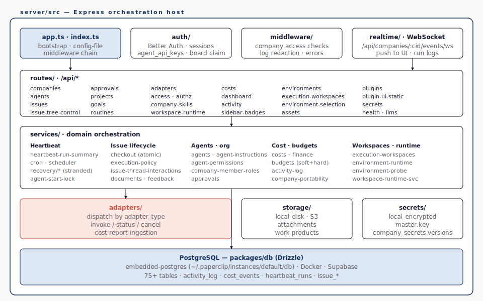

# Server & API — Express · Routes · Services · WebSocket

## 1. 한 호스트, 두 종류의 클라이언트

Paperclip API의 첫 번째 결정은 단순하다 — **하나의 REST 표면, 두 가지 인증**이다. 같은 `/api/...` 엔드포인트가 (1) 보드 운영자(웹 UI · CLI)와 (2) 에이전트(API key)를 동시에 받는다. 어떤 키로 들어왔는가가 권한을 결정한다. 이는 SPEC §8의 *"Single unified REST API"* 결정이다.

**그림 3**이 server/src의 내부 토폴로지를 한 페이지로 그려 준다.

**그림 3. server/src의 내부 토폴로지 — auth · middleware · realtime · routes · services · adapters · DB**



inbound (`app.ts` · `auth/` · `middleware/` · `realtime/`)에서 들어와 → routes/로 분기 → services/가 도메인 로직을 담당 → adapters/가 외부 런타임을 부르고 → DB · storage · secrets가 영속화한다. 모든 mutating 작업은 `activity_log`에 한 줄을 남긴다. 그림 3의 핵심 관찰점은 두 가지다. (1) `routes/`는 "얇은 컨트롤러"로, `services/`는 "두꺼운 도메인"으로 그려져 있다. 이는 §3의 디렉터리 트리에서도 확인되는 비대칭이며, 라우트 한 줄을 바꾸는 일보다 도메인 로직 변경에 4개 레이어(db/shared/server/ui) 동기화가 더 자주 따라오는 이유다. (2) `realtime/`은 같은 HTTP 서버를 공유하지만 *별도 inbound 경로*다. WebSocket 라이브 채널은 Express 라우트가 아니라 HTTP server의 `upgrade` handler에 붙는 `ws` 서버로, 인증도 REST와 다른 별도 `authorizeUpgrade` (local_trusted / Better Auth session / agent API key) 가 처리한다(`server/src/realtime/live-events-ws.ts:63-176`). 같은 회사 스코프 검증으로 수렴할 뿐, REST의 actorMiddleware를 그대로 재사용하지는 않는다.

## 2. routes/ — 엔드포인트 카탈로그

`server/src/routes/` 에는 36개의 라우트 파일이 있다. **표 1** 이 보드 운영자 시점에서 의미 있는 것을 묶는다.

**표 1. 주요 REST 엔드포인트 군**

| 라우트 그룹 | 책임 | 대표 엔드포인트 |
|---|---|---|
| `companies.ts` | 회사 lifecycle | `GET/POST /api/companies`, `PATCH /api/companies/:id` |
| `agents.ts` (120 KB) | 에이전트 CRUD · 상태 | `POST /api/companies/:companyId/agents`, `POST /api/agents/:id/pause` |
| `issues.ts` (180 KB) | 이슈 풀 lifecycle + recovery action | `GET/POST /api/companies/:companyId/issues`, `PATCH /api/issues/:id`, `POST /api/issues/:id/checkout`, `POST /api/issues/:id/release`, `POST /api/issues/:id/comments`, `GET /api/issues/:id/recovery-actions`, `POST /api/issues/:id/recovery-actions/resolve` |
| `issue-tree-control.ts` | tree hold · 통제 | `POST /api/issues/:id/tree-holds`, `GET /api/issues/:id/tree-control/state` *(blocker 추가/제거는 별도 라우트가 아니라 `PATCH /api/issues/:id` 의 `blockedByIssueIds` payload)* |
| `approvals.ts` | 보드 승인 게이트 | `GET/POST /api/companies/:companyId/approvals`, `POST /api/approvals/:id/approve`, `POST /api/approvals/:id/reject`, `POST /api/approvals/:id/resubmit` |
| `costs.ts` | cost rollup 및 차트 | `GET /api/companies/:companyId/costs/summary`, `…/costs/by-agent`, `…/costs/by-project`, `…/budgets/overview`, `POST /api/companies/:companyId/cost-events` |
| `activity.ts` | 감사 로그 조회 | `GET /api/companies/:companyId/activity` |
| `routines.ts` | cron-style 정기 작업 | `GET/POST /api/companies/:companyId/routines`, `PATCH /api/routines/:id`, `POST /api/routines/:id/run` |
| `adapters.ts` | 어댑터 메타데이터 | `GET /api/adapters` |
| `environments.ts`, `execution-workspaces.ts` | 작업 공간/런타임 | `POST /api/projects/:pid/workspaces` |
| `plugins.ts` (89 KB), `plugin-ui-static.ts` | 플러그인 lifecycle / UI ext | `POST /api/plugins/install` |
| `secrets.ts` | 회사 비밀·provider vault·remote import·rotate·access audit | `POST /api/companies/:companyId/secrets`, `GET /api/companies/:companyId/secret-providers`, `GET/POST /api/companies/:companyId/secret-provider-configs`, `POST /api/companies/:companyId/secrets/remote-import`, `POST /api/secrets/:id/rotate`, `GET /api/secrets/:id/access-events` |
| `health.ts`, `dashboard.ts`, `sidebar-badges.ts` | 상태/뱃지 | `GET /api/health` |
| `org-chart-svg.ts` | org chart 렌더 helper (mount는 `agents.ts`) | `GET /api/companies/:companyId/org.svg`, `…/org.png` |

표 1을 *세로로* 읽으면 한 가지 패턴이 드러난다 — *읽기 라우트는 회사 스코프 (`/api/companies/:companyId/...`), 단건 mutating 라우트는 짧은 경로 (`/api/issues/:id/...`)* 라는 비대칭이다. 이는 *권한 검사가 회사 멤버십 체크 한 번으로 끝나는 라우트*와 *대상 엔터티 자체에서 회사를 역추적해야 하는 라우트*의 두 패턴이다. `issues.ts`가 180 KB에 달하는 사실은 이 도메인이 가장 풍부함을 보여 준다 — checkout, status 전이, blocker, parent/sub-issue, thread interaction, monitor, recovery 등 6\~7개 보조 모델을 함께 다룬다.

## 3. services/ — 도메인 오케스트레이션

라우트가 *얇은 컨트롤러* 라면, services/ 는 *두꺼운 도메인* 이다. 디렉터리 구성을 5개 도메인으로 묶으면 다음과 같다. **코드 1** 이 그 5개 도메인 트리이며, 각 군집의 KB 표기가 *어디에 도메인 무게가 쏠려 있는지* 를 그대로 보여 준다 — `company-portability.ts` 180 KB, `routes/issues.ts` 180 KB(§2 표 1) 가 가장 큰 두 봉우리.

**코드 1. `server/src/services/` 의 5-도메인 디렉터리**

```text
server/src/services/
├── (heartbeat · recovery)
│   ├── cron.ts                   # 스케줄러
│   ├── heartbeat-run-summary.ts  # 한 회차 요약
│   ├── recovery/                 # stranded 회복 7-pass
│   ├── issue-recovery-actions.ts # source-scoped recovery action upsert/resolve
│   ├── agent-start-lock.ts       # 동시 시작 방지
│   └── adapter-plugin-store.ts
├── (issue lifecycle)
│   ├── issue-thread-interactions.ts
│   ├── execution-workspace-policy.ts
│   ├── documents.ts · feedback.ts
│   ├── approvals.ts
│   └── company-portability.ts    # 180 KB — export/import
├── (agents · org · auth)
│   ├── agents.ts (28 KB)
│   ├── agent-instructions.ts
│   ├── agent-permissions.ts
│   ├── company-member-roles.ts
│   ├── board-auth.ts
│   └── access.ts
├── (cost · budget)
│   ├── costs.ts
│   ├── budgets.ts (31 KB)
│   ├── finance.ts
│   └── activity-log.ts
└── (workspaces · runtime)
    ├── execution-workspaces.ts
    ├── environment-runtime.ts (44 KB)
    ├── environment-config.ts
    └── environment-probe.ts
```

`company-portability.ts` 가 180 KB 인 점이 흥미롭다 — 회사 전체를 *템플릿* 또는 *스냅샷* 으로 export/import 하는 로직이 거기 모여 있다. 이는 SPEC §2 의 *"Exportable Org Configs"* 약속의 구현부다.

## 4. realtime/ — WebSocket 라이브 이벤트 채널

UI 가 보드를 보고 있는 동안 새 cost event 가 들어오거나 이슈 상태가 바뀌면, 사용자는 새로 고침 없이 그 변화를 봐야 한다. Paperclip 은 이를 **WebSocket** 으로 푼다 (`server/src/realtime/live-events-ws.ts:63-176`) — Express 라우트가 아니라 HTTP server의 `upgrade` handler에 붙는 `ws` 서버다. UI 는 `LiveUpdatesProvider` 가 회사 단위로 한 소켓을 열어 두고, 들어온 이벤트로 TanStack Query 캐시를 무효화한다. 코드 2 가 두 종류의 클라이언트가 같은 WebSocket 엔드포인트를 어떻게 다른 인증 방식으로 부르는지 보여 준다 — 브라우저는 *세션/local_trusted*, 헤드리스는 *agent API key Bearer*.

**코드 2. WebSocket 라이브 채널 핸드셰이크 — 브라우저 vs 헤드리스**

```text
# 보드 UI (브라우저 same-origin)
new WebSocket(`${proto}://${host}/api/companies/:companyId/events/ws`)
  → upgrade 시 별도 헤더 없음. authorizeUpgrade가 Better Auth 세션 또는
    local_trusted board context 를 검증.

# 에이전트 (헤드리스)
GET wss://<host>/api/companies/:companyId/events/ws
Authorization: Bearer <agent api key>
  → authorizeUpgrade가 agent_api_keys 조회로 검증.
```

브라우저는 [WebSocket API](https://developer.mozilla.org/en-US/docs/Web/API/WebSocket) 가 사용자 정의 헤더 첨부를 허용하지 않으므로 *세션/로컬 신뢰 경로* 만 가능하고, 헤드리스 클라이언트는 *agent API key Bearer* 로 인증한다. board API key는 REST의 `actorMiddleware` 에서만 허용되고 WebSocket upgrade 경로의 Bearer는 현재 agent API key 전용이다. 서버는 두 경로 모두를 같은 회사 스코프로 검증한다.

각 메시지는 JSON 한 줄이며 `LiveEvent` 타입을 따른다 — `id`, `companyId`, `type`, `createdAt`, `payload`. 이벤트 타입은 `packages/shared/src/constants.ts` 의 `LIVE_EVENT_TYPES` 가 단일 소스다.

**표 2. 주요 라이브 이벤트 (LIVE_EVENT_TYPES)**

| 이벤트 | 트리거 | 페이로드 (요약) |
|---|---|---|
| `heartbeat.run.queued` | `heartbeat_runs` insert (`status='queued'`) | runId, agentId, invocation_source |
| `heartbeat.run.status` | `heartbeat_runs` 상태 전이 | runId, status, finished_at? |
| `heartbeat.run.event` | run 진행 중 도메인 이벤트 | runId, kind, summary |
| `heartbeat.run.log` | stdout/stderr/세그먼트 로그 | runId, stream, chunk |
| `agent.status` | 에이전트 ready/busy/paused 변화 | agentId, status |
| `activity.logged` | `activity_log` insert | actor_type/id, action, entity_type/id |
| `plugin.ui.updated` | 플러그인 UI bundle 갱신 | pluginId, version |
| `plugin.worker.crashed` / `plugin.worker.restarted` | 플러그인 워커 lifecycle | pluginId, reason? |

표 2 의 9개 type (`packages/shared/src/constants.ts:596-606`, 표는 `plugin.worker.crashed`/`restarted`를 한 행으로 묶었지만 type 카운트는 9개) 만 보면 *도메인 이벤트가 의외로 적다* 는 인상을 받는다 — 이슈 변경, 비용 추가, 승인 결정 등의 *업무 의미* 이벤트가 별도 type 으로 잡히지 않기 때문이다. 그 이유는 다음 한 줄로 정리된다 — 이슈/비용/예산은 별도 토픽이 아니라 **`activity.logged`** 의 `entity_type` (`issue`, `cost_event`, `approval`, `budget_incident` 등)으로 노출되며, UI 는 entity_type 으로 라우팅해 해당 query 를 무효화한다. 이 단일 이벤트 관문 덕분에 새 엔터티가 추가돼도 라이브 채널 코드를 손대지 않고 *`activity_log` 에 한 줄을 남기는 것* 만으로 보드 UI 까지 자동 반영된다.

> SSE가 완전히 빠진 것은 아니다. 플러그인 브리지 스트림(`server/src/routes/plugins.ts:1363-1423`)은 텍스트 스트림이 더 자연스러운 *plugin → board* 메시지를 SSE로 흘린다. 단, 메인 보드 라이브 업데이트는 WebSocket 채널을 사용한다.

자세한 패턴 비교(SSE vs WebSocket)는 [docs/research/09-sse-heartbeat-patterns.md](../research/09-sse-heartbeat-patterns.md).

## 5. auth/ — Better Auth + board/agent credential 표면

`server/src/auth/` 는 [Better Auth](https://www.better-auth.com/) 위에 board actor 모드 2종 + agent credential 경로 2종을 얹는다(`server/src/middleware/auth.ts:24-199`). 표 3 이 그 네 표면이다.

**표 3. 인증 주체와 credential 경로**

| 주체 | 어떻게 들어오는가 | 어디까지 볼 수 있는가 |
|---|---|---|
| 보드 사용자 (사람) | Better Auth 세션 쿠키 (`authenticated` 모드) | 자기 회사들의 모든 데이터, instance admin 이라면 인스턴스 전역 |
| `local-board` 가짜 사용자 | `local_trusted` 모드 — 로그인 없음 | 단일 운영자 시나리오 (로컬 데스크톱) |
| 보드 API key | `board_api_keys` (해시 저장) → `Authorization: Bearer …` | CLI · CI · 자동화용. 보드 사용자 권한 범위 |
| 에이전트 (persistent) | `agent_api_keys` → `Authorization: Bearer agent_…` | 자기 회사 내 자기 권한 범위 |
| 에이전트 (단명 JWT) | local heartbeat 실행 시 `createLocalAgentJwt` 가 발급, `actorMiddleware` 가 `verifyLocalAgentJwt` 로 `source: "agent_jwt"` actor 생성 (`server/src/agent-auth-jwt.ts:68-95`, `server/src/services/heartbeat.ts:7649`) | persistent key와 동일 권한 범위, 회차 단위 만료 |

표 3 은 *권한 폭이 좁아지는 순서* 로 정렬되어 있다 — 보드 사용자가 가장 넓고, 가짜 사용자(`local-board`)와 보드 API 키가 board actor 권한을 공유하며, 에이전트 credential 두 경로(persistent API key / 단명 local JWT)는 자기 회사·자기 권한 범위에 한정된다. `authenticated` 모드 + 단일 인스턴스 admin 이 `local-board` 인 상황에서는 `/board-claim/<token>?code=<code>` 형태의 1회용 클레임 URL 이 부팅 시 콘솔에 출력된다. 사람이 그 URL 로 자기 계정을 인스턴스 admin 으로 승격시키면 `local-board` 권한은 자동 강등된다. 이는 *로컬 → 인증 모드* 마이그레이션 시 록아웃을 막기 위함이다(`doc/DEPLOYMENT-MODES.md` §7).

## 6. middleware/ — 회사 경계와 redaction

라우트 본체에 도달하기 전 미들웨어가 다음을 강제한다.

1. **회사 멤버십** — URL 의 `:companyId` 가 현재 주체에 보이는지 검사
2. **에이전트 키 격리** — `agent_api_keys` 는 자기 회사만, 자기 에이전트 본인의 권한 범위만
3. **로그 redaction** — 비밀 값(secrets, env)이 활동 로그에 새지 않도록 마스킹
4. **에러 매핑** — 4xx / 409(conflict) / 422(validation) / 500 을 일관되게 변환

이 미들웨어 체인은 `AGENTS.md` 의 §8 *API and Auth Expectations* 섹션이 강제하는 약속과 1:1 대응한다.

## 7. 설치형 플러그인 런타임

`packages/plugins`가 정의한 plugin SDK 위에 server/src가 다음 hook을 구현한다. 코드 3 이 그 6가지 hook 카테고리다 — *언제 들어오고, 어디에 데이터를 두며, 무엇을 들을 수 있고, 어떤 UI 영역을 채우며, 새 어댑터까지 등록하고, 회사 자원을 manifest로 선언해 동기화할 수 있는지* 한 페이지에 정리.

**코드 3. plugin SDK의 6가지 hook 카테고리**

```text
plugin lifecycle    : install / activate / configure / deactivate / uninstall
data namespaces     : plugin_database_namespaces 에 마이그레이션 별도 추적
events / webhooks   : issue.* / agent.* / approval.* / cost.* 구독
UI extensions       : 글로벌 툴바 버튼, 사이드바 항목, 설정 페이지
adapter plugins     : adapter_type=<plugin-id> 로 새 어댑터 등록
managed resources   : agents / projects / routines / skills 를 manifest로 선언하면 회사
                      스코프 자원과 동기화 — agents/routines/skills는
                      plugin-managed-{agents,routines,skills}.ts, projects는
                      projects.ts 의 resolveManagedProject 경로
```

이 통로 덕분에 *지식 베이스 · 매출 회계 · 새 어댑터* 같은 V1 범위 밖 기능을 코어 수정 없이 도입할 수 있다.

## 8. 요약

> **Paperclip의 서버는 "한 표면, 두 사용자, 5개 서비스 도메인"이다.** Express 라우트는 얇고, services/가 두껍고, 라이브 이벤트는 회사 단위 WebSocket 한 줄로 흐르며, 플러그인 런타임이 코어 수정 없는 확장을 허용한다.

[06-ui-and-board.md](06-ui-and-board.md)는 보드 UI — React + Vite + shadcn/ui — 가 이 표면을 어떻게 그리는지 분석한다.
