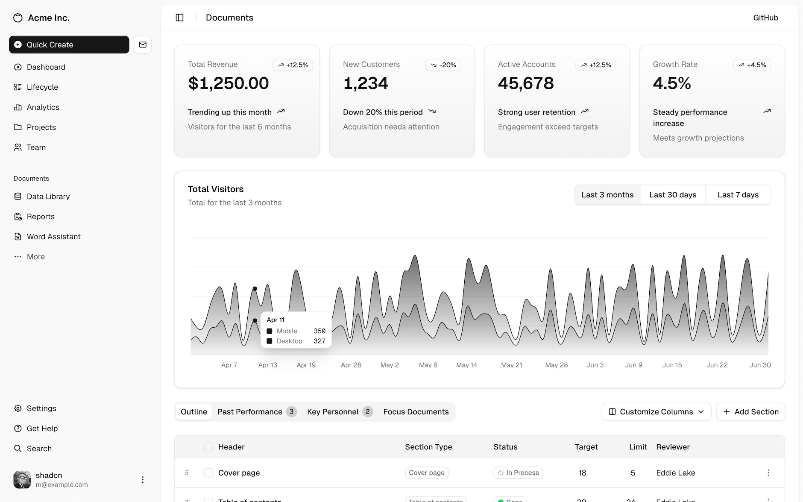

# UI & Board — React · Vite · shadcn/ui

## 1. UI의 위치

`ui/` 는 보드 운영자가 일상적으로 머무는 single page application 이다. 기술 스택은 다음과 같다(`ui/package.json:30-78`) — **Vite 6 + React 19 + TypeScript + Tailwind CSS 4 + shadcn/ui + Radix UI + TanStack Query 5 + react-router-dom 7**. 같은 프로젝트에 Storybook 이 별도 디렉터리로 동거(`ui/storybook/`)한다. 프런트엔드 기술 토대의 자세한 설명은 [docs/research/08-react-vite-shadcn.md](../research/08-react-vite-shadcn.md).

shadcn/ui 의 **공식 dashboard-01 블록** 은 이 톤의 표준 모범이다 — Paperclip 보드 UI 는 그 위에 회사·이슈·코스트 도메인을 입혔다. 그림 6-1 은 *외부 인용 다이어그램* 으로, Paperclip 자체 스크린샷이 아니라 디자인 톤의 *원형* 을 보여 준다 — 좌측 사이드바 + 상단 헤더 + 그리드 카드 위주의 대시보드 레이아웃이 Paperclip `/dashboard` 와 1:1 로 이어진다.

**그림 6-1. shadcn/ui 공식 dashboard-01 블록 (출처: ui.shadcn.com)**



## 2. 70+ 페이지의 라우팅 표

`ui/src/App.tsx` 에 등록된 페이지를 도메인으로 묶으면 다음과 같다(편의상 일부만 발췌).

**표 1. 주요 페이지 라우팅**

| 도메인 | 경로 | 페이지 컴포넌트 | 책임 |
|---|---|---|---|
| 대시보드 | `/dashboard`, `/dashboard/live` | `Dashboard.tsx`, `DashboardLive.tsx` | 한눈에 보는 회사 상태 + 라이브 활동 피드 |
| 회사 | `/companies`, `/company/settings`, `/company/settings/{environments,access,invites,secrets}` | `Companies.tsx`, `CompanySettings.tsx`, `CompanyAccess.tsx`, `CompanyEnvironments.tsx`, `CompanyInvites.tsx`, `Secrets.tsx` (2,155 LOC) | 회사 lifecycle · 환경 · 멤버십 · 초대 · secrets/vault |
| 회사 export/import | `/company/export/*`, `/company/import` | `CompanyExport.tsx`, `CompanyImport.tsx` | 템플릿/스냅샷 portability |
| Org / 에이전트 | `/org`, `/agents/all`, `/agents/active`, `/agents/paused`, `/agents/error`, `/agents/new`, `/agents/:agentId(/:tab)` | `OrgChart.tsx`, `Agents.tsx`, `NewAgent.tsx`, `AgentDetail.tsx` | 조직도 + 에이전트 상세 |
| 이슈 | `/issues`, `/issues/:issueId` | `Issues.tsx`, `IssueDetail.tsx` | 이슈 보드 + 상세. `IssueRecoveryActionCard.tsx`(537 LOC)가 상세/스레드에서 recovery action을 표시·resolve |
| 인박스 | `/inbox/{mine,recent,unread,all,requests}` | `Inbox.tsx`, `JoinRequestQueue.tsx` | 내 작업·요청 큐 |
| 프로젝트 | `/projects`, `/projects/:projectId(/{overview,issues,workspaces,configuration,budget})` | `Projects.tsx`, `ProjectDetail.tsx`, `ProjectWorkspaceDetail.tsx` | 프로젝트 칸반 + 워크스페이스 |
| 워크스페이스 | `/workspaces`, `/execution-workspaces/:workspaceId(/{services,configuration,runtime-logs,issues,routines})` | `Workspaces.tsx`, `ExecutionWorkspaceDetail.tsx` | 실행 워크스페이스 + 런타임 서비스 |
| Goal | `/goals`, `/goals/:goalId` | `Goals.tsx`, `GoalDetail.tsx` | 골 트리 |
| 비용·활동 | `/costs`, `/activity` | `Costs.tsx`, `Activity.tsx` | 토큰/달러 차트 · 감사 활동 피드 |
| 승인 | `/approvals/pending`, `/approvals/all`, `/approvals/:approvalId` | `Approvals.tsx`, `ApprovalDetail.tsx` | 보드 승인 큐 |
| 인스턴스 설정 | `/instance/settings/adapters`, `/instance/settings/plugins`, `/instance/settings/plugins/:pluginId` | `AdapterManager.tsx`, `PluginManager.tsx`, `PluginSettings.tsx` | 인스턴스 단위 어댑터 활성화 + 플러그인 lifecycle 관리 |
| 플러그인 UI (회사 스코프) | `/plugins/:pluginId`, `/:pluginRoutePath/*` | `PluginPage.tsx` | 플러그인이 회사 스코프에 노출하는 UI ext |
| 스킬 | `/skills/*` | `CompanySkills.tsx` | 회사 skill 관리 |
| 라우틴 | `/routines`, `/routines/:routineId` | `Routines.tsx`, `RoutineDetail.tsx` | cron-style 정기 작업 |
| 검색·디자인 | `/search`, `/design-guide` | `Search.tsx`, `DesignGuide.tsx` | 글로벌 검색 + 컴포넌트 쇼룸 |
| 사용자·인증 | `/u/:userSlug`, `/auth`, `/cli-auth/:id`, `/board-claim/:token`, `/invite/:token` | `UserProfile.tsx` 외 | 프로필 + 로그인 + CLI/보드/초대 인증 (보드 외부 라우트 일부 포함) |
| Cloud upstream (#6548, 신규) | `/company/settings/cloud-upstream`, `/ux-lab/cloud-upstream` | `CloudUpstream.tsx` (646 LOC), `CloudUpstreamUxLab.tsx` (822 LOC) | 로컬 인스턴스 → cloud upstream 회사 push 동기화 + UX lab 변형 |

표 1 의 도메인 중 *3개* (이슈·org·승인) 가 보드 UI 의 일상적 표면이고, 나머지는 *간헐적 표면* 이다. 페이지 컴포넌트의 LOC 도 그 일상도와 대체로 정비례한다 — `AgentDetail.tsx`, `IssueDetail.tsx`, `Inbox.tsx`, `Secrets.tsx`(2,155 LOC, secrets/vault 화면이 크게 비대해진 사례) 가 가장 무거운 페이지군이다. 거의 모든 페이지가 `react-router-dom` 의 `<Outlet>` 위에 컴포지션되며, 회사 선택은 라우트 컨텍스트로 전역 주입된다.

이 라우팅 표를 제품 흐름으로 다시 읽으면 Paperclip UI의 중심은 "설정 화면이 많은 관리 콘솔"이 아니라 **운영자가 오늘 개입해야 하는 지점을 좁혀 주는 보드**다. `/dashboard/live`는 지금 움직이는 run과 활동 로그를 보여 주고, `/approvals`는 사람의 판단이 멈춰 있는 큐를 모으며, `/issues/:id`와 `/agents/:id`는 각각 작업 단위와 행위자 단위의 원인 추적 화면이다. 따라서 좋은 Paperclip UI는 페이지 수가 많다는 사실보다, 이 세 표면 사이를 얼마나 적은 클릭으로 오가게 하느냐가 중요하다. 예를 들어 cost spike가 발생했을 때 운영자가 따라야 하는 경로는 `Costs` → 관련 agent/issue → run transcript → pause/approval 결정으로 이어져야 한다. 이 연결이 끊기면 control plane은 "보고는 많은데 결정을 못 내리는" 대시보드가 된다.

### 2.1 최근 추가된 UI 면 — 2026-05 사이클(#6070\~#6560)

직전 16커밋 사이클(2026-05-16) 이후 37커밋이 들어오면서 UI 표면이 다섯 축에서 동시에 확장됐다.

- **i18n locale catalog (#6070, #6058)** — `ui/src/i18n/locales/` 에 **39개 언어 JSON** 이 들어왔다(ar/bn/cs/da/de/el/es/fa/fi/fil/fr/he/hi/hu/id/it/ja/ko/mr/ms/nb/nl/pa/pl/pt-BR/pt-PT/ro/ru/sv/sw/ta/te/th/tr/uk/ur/vi/zh-CN/zh-TW). 직전 사이클의 *minimal i18next foundation* 단계에서 *프로덕션 locale catalog* 단계로 넘어왔다. 본문 키 자체는 아직 minimal이지만, 보드 운영자가 자기 locale 을 선택할 수 있는 토대가 만들어졌다.
- **모바일 보드 흐름 폴리시(#6550)** — `Layout.tsx`, `MarkdownBody.tsx`(wrap test 100 LOC), `NewIssueDialog.tsx`, `CompanySettingsNav.tsx`, `ui/index.css`, PWA `site.webmanifest` 등 다수 컴포넌트가 모바일 viewport 흐름과 PWA 설치 모드(`lib/pwa-install-mode.ts`) 를 보강했다. README 가 약속한 "Mobile Ready" 슬로건의 *일부* 가 데스크톱 외 표면으로 실제 확장된 사례.
- **secret/vault UX 통합(#6339, #6381)** — `JsonSchemaForm.tsx` 가 `SecretBindingPicker` 를 인라인 secret-ref 필드와 결합하고, `Secrets.tsx` (2,155 LOC) 에 AWS Secrets Manager provider vault UX 가 들어왔다(`aws-discovery-candidates`, `provider-vaults-tab`, `remove-provider-vault-confirmation` 스크린샷). 보드는 이제 단일 secret 입력 화면에서 외부 vault 와 로컬 secret 을 같은 picker 로 다룬다.
- **dev/ops surfaces(#6384)** — `DevRestartBanner.tsx`(데스크톱·모바일 두 변형, 113 LOC test) 가 개발 인스턴스 재시작 신호를 보드 상단에 띄우고, `MarkdownEditor.tsx`/`Sidebar.tsx`/`SidebarProjects.tsx`/`Inbox.tsx` 가 함께 폴리시됐다. `ui/storybook/stories/dev-ops-surfaces.stories.tsx` 가 새로 추가되어 dev/ops 표면이 storybook 상에서 회귀 추적된다.
- **inbox/instance/invite 단순화(#6269, #6341, #6433)** — inbox 행에서 planning 배지 제거(#6269), Instance Settings 사이드바에서 sandbox-provider 플러그인 숨김(#6341), 초대 페이지 query-key 충돌로 인한 white screen 수정(#6433).
- **workspace diff viewer 플러그인 UI(#6071, #6383)** — 신규 플러그인 `packages/plugins/plugin-workspace-diff/src/ui/index.tsx` (854 LOC) 가 워크스페이스 diff 를 보드 안에서 시각화하고, `MissingPluginTabPlaceholder.tsx`, `ExecutionWorkspaceDetail.tsx`, `ProjectWorkspaceDetail.tsx` 가 플러그인 슬롯과 통합된다.

이 6축 확장은 보드 UI 의 *지배 경로*(이슈·org·승인) 를 늘리지는 않았다 — 그 옆의 *인스턴스/회사 설정 표면*, *보드 외부 인증 흐름*, *플러그인 슬롯*, *모바일·i18n* 같은 *세컨더리 표면*이 동시에 두꺼워졌다. 즉 이번 사이클의 UI 변화는 "보드를 더 깊게" 가 아니라 "보드 주변을 더 평평하게" 만드는 방향이다.

## 3. 디렉터리 구조

코드 1 이 `ui/src/` 의 표준 트리다 — 두 확장점은 로딩 계약이 다르다. `adapters/` 는 built-in 어댑터 UI를 정적 registry에 등록(`ui/src/adapters/registry.ts`)하고, 외부 어댑터의 동적 부분은 `/api/adapters/:type/ui-parser.js` 를 fetch해 sandboxed Web Worker 안에서 parser source를 실행하는 *parser bridge* 방식이다(`ui/src/adapters/dynamic-loader.ts`). 반면 `plugins/` 는 `ui/src/plugins/slots.tsx` 에서 dynamic ESM `import()` 로 플러그인 UI를 로딩한다. `api/` 가 `packages/shared` 의 zod 스키마를 그대로 import 해 *타입 끝까지 안전* 의 모노레포 이득을 챙기는 점은 두 확장점이 공통이다.

**코드 1. `ui/src/` 디렉터리 구조**

```text
ui/src/
├── App.tsx              # 라우팅 트리
├── components/          # 도메인 위젯 + 공용 컴포넌트 — Sidebar.tsx 는
│                        # SidebarSection / SidebarAgents / SidebarProjects 를
│                        # 조합해 회사 내비게이션을 구성한다(#5585 분할).
│                        # IssueRecoveryActionCard.tsx 는 IssueDetail/IssueChatThread 에
│                        # 마운트되어 recovery action을 표시·resolve 한다.
├── api/                 # fetch 래퍼 + zod 검증
├── adapters/            # built-in 어댑터 UI registry + 외부 어댑터 ui-parser.js
│                        # sandboxed Web Worker bridge
├── plugins/             # 플러그인 UI ext — dynamic ESM import()
├── context/             # 회사·인증·라이브 업데이트(WebSocket) 컨텍스트
├── hooks/
├── pages/               # 페이지 컴포넌트 (위 표)
├── lib/                 # utility
├── fixtures/            # mock 데이터 (Storybook · 테스트)
└── main.tsx             # Vite entry
```

`api/` 가 `packages/shared` 의 zod 검증을 그대로 import 해 type 안전성을 끝까지 유지한다는 점이 모노레포 구성의 큰 이득이다. server / shared / ui 가 같은 타입 정의를 공유하므로, 스키마 변경이 컴파일 시점에 모든 클라이언트에 전파된다.

## 4. 데이터 플로우 — TanStack Query + WebSocket

서버 상태는 **TanStack Query** 가 캐시·재시도·자동 invalidation 을 담당한다. `LiveUpdatesProvider` 가 회사 단위 WebSocket 한 소켓을 열어 두고, 들어온 `LiveEvent` 의 `type`/`entity_type` 으로 query key 를 invalidate 해 즉시 새 fetch 가 흐르는 구조다. **코드 2** 가 그 패턴을 *useQuery + useEffect(WebSocket)* 한 쌍으로 압축한다 — 캐시는 TanStack Query 가, push invalidation 은 라이브 채널이.

**코드 2. TanStack Query + WebSocket 라이브 invalidation 패턴**

```ts
// 의사코드 — 실제 구현은 ui/src/context/LiveUpdatesProvider.tsx
const { data: issues } = useQuery({
  queryKey: ['issues', companyId, filters],
  queryFn: () => api.issues.list(companyId, filters)
});

useEffect(() => {
  const proto = location.protocol === 'https:' ? 'wss' : 'ws';
  const ws = new WebSocket(
    `${proto}://${location.host}/api/companies/${encodeURIComponent(companyId)}/events/ws`,
  );
  ws.onmessage = (msg) => {
    const event = JSON.parse(msg.data); // { type, payload, ... }
    if (event.type === 'activity.logged' && event.payload.entity_type === 'issue') {
      qc.invalidateQueries({ queryKey: ['issues', companyId] });
    } else if (event.type === 'heartbeat.run.status') {
      qc.invalidateQueries({ queryKey: ['runs', companyId] });
    }
    // …나머지 LIVE_EVENT_TYPES (heartbeat.run.*, agent.status, plugin.*) 로 분기
  };
  return () => ws.close();
}, [companyId]);
```

이 구조 덕분에 *클라이언트 캐시 + push invalidation* 의 두 축이 합쳐져, 보드 UI 는 폴링 없이 즉시 반응한다.

다만 이 방식은 이벤트 자체가 최종 데이터를 담는 event sourcing 모델이 아니다. WebSocket 메시지는 대부분 "무엇이 바뀌었는가"를 알려 주고, 실제 화면 데이터는 TanStack Query가 다시 REST API로 가져온다. 장점은 클라이언트 상태 복제가 단순하다는 점이고, 한계는 네트워크가 불안정할 때 짧은 순간 stale view가 보일 수 있다는 점이다. 그래서 UI가 mutation 실패를 조용히 삼키지 않고, invalidate 이후 refetch 오류를 화면에 드러내는 것이 중요하다. 이는 `AGENTS.md`의 "Surface failures clearly" 규칙과도 맞물린다.

## 5. shadcn/ui — "패키지가 아니라 코드 복사"

shadcn/ui 는 **npm 패키지가 아니다** — `npx shadcn add button` 같은 CLI 가 컴포넌트 *소스 코드* 를 프로젝트에 복사해 넣는 분배 모델이다. Radix UI 의 비스타일 primitives 위에 Tailwind 스타일을 입혀 둔 형태이며, 사용자는 그 코드를 그대로 갖고 자유롭게 수정한다. Paperclip 의 `ui/components/` 는 이 모델을 따른다.

장점은 두 가지다. (1) 의존성 잠금에서 자유롭다 — 라이브러리 마이그레이션이 없다. (2) 디자인 시스템을 회사 색·브랜드에 맞춰 변형할 수 있다. Paperclip 보드 UI 는 회사별 `brand_color` 컬럼(`packages/db/src/schema/companies.ts:28`)을 `CompanyPatternIcon` 의 패턴 색상과 회사 선택/생성 UI의 색상 스와치에 연결한다.

## 6. 단일 origin dev 모드 — Express 미들웨어

`server/src/app.ts` 는 dev 환경에서 Vite 를 **middleware** 로 마운트한다. **코드 3** 이 그 부팅 의사코드다 — Express 한 인스턴스가 `/api` 와 SPA 자산을 같은 origin 에서 동시에 서빙한다.

**코드 3. dev 모드 — Express 안에 Vite middleware 마운트**

```ts
// 개발 서버 부팅 (의사코드)
const app = express();
const vite = await createViteServer({ server: { middlewareMode: true } });
app.use('/api', apiRouter);
app.use(vite.middlewares); // SPA 자산을 같은 호스트에서 제공
app.listen(3100);
```

이 구성의 효과는 다음과 같다. (1) **CORS 가 필요 없다** — UI 의 `fetch('/api/...')` 가 같은 origin 으로 떨어진다. (2) **인증 쿠키도 단순** — Better Auth 세션이 같은 origin 에서 set/read 된다. (3) **빌드 후에는** Express 가 `ui/dist/*` 를 정적으로 서빙한다. (4) **HMR 도 동일 origin** — Vite WS 가 그대로 동작한다.

## 7. 디자인 가이드 — `/design-guide`

`ui/src/pages/DesignGuide.tsx` (56 KB)는 Paperclip 보드 UI의 디자인 시스템을 한 페이지에 모아 둔 라이브 문서다. 컬러 토큰 · 타이포그래피 · 스테이터스 칩 · 우선순위 시그널 · 컴포넌트 컴포지션 패턴이 함께 정리되어 있다. 신규 컴포넌트는 이 페이지의 패턴을 기준으로 검토된다.

## 8. Storybook

`ui/storybook/` 가 컴포넌트 단위 카탈로그를 제공한다. `pnpm storybook` 으로 6006 포트에 띄우거나, `pnpm build-storybook` 으로 정적 사이트를 만든다. 컴포넌트 PR 의 시각적 회귀를 잡는 일차 도구다.

## 9. UI 없이 운영할 수 있는가

실제로는 가능하다. CLI (`paperclipai`) + 에이전트 API + MCP 서버만으로 회사를 만들고 이슈를 만들고 비용을 보고할 수 있다. 그러나 **승인 큐와 cost 차트**를 사람의 눈으로 봐야 하는 상황에서는 보드 UI가 사실상 의무다 — 그래서 SPEC §10의 V1 must-have 안에 Web UI가 명시되어 있다.

[07-governance-cost.md](07-governance-cost.md)는 Board · Approvals · Budgets · Activity Log의 거버넌스 축을 한 묶음으로 분석한다.
