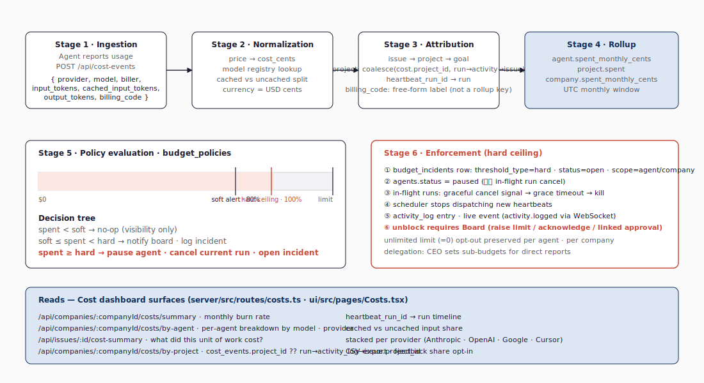

# Governance & Cost — Board · Approvals · Budget · Activity Log

## 1. 사람이 떠나지 않는 자리

자율 에이전트 회사의 핵심 이슈는 *얼마나 자율인가*가 아니라 *어디서 인간이 결정해야 하는가*다. Paperclip은 그 자리를 **Board**라는 이름으로 명시한다. SPEC §1은 다음을 포함한다.

- **승인 게이트** — 신규 에이전트 고용, CEO의 초기 전략 분해
- **항상 가용한 권한** — 회사 예산 설정, 임의의 에이전트/이슈/프로젝트 일시정지·재개, 풀 PM 권한, 모든 에이전트 결정의 override, 임의 단계의 예산 수정

V1의 보드는 *단일* 인간 운영자다(SPEC §10의 *Single human Board.*).

## 2. 승인 흐름 — `approvals` 테이블

승인은 단일 테이블 `approvals` 로 정규화된다. 실제 컬럼은 다음과 같다(`packages/db/src/schema/approvals.ts`). 코드 1 이 12개 컬럼을 한 화면에 모은 것이며, 대상 식별을 별도 `subject_*` 컬럼이 아니라 **`type` + `payload` jsonb** 로 표현한 점이 가장 큰 설계 결정이다.

**코드 1. `approvals` 테이블의 핵심 컬럼**

```ts
approvals {
  id, company_id,
  type,                                // APPROVAL_TYPES (아래 4종)
  requested_by_agent_id?,              // user/agent/system(둘 다 null) 요청자 가능
  requested_by_user_id?,
  status,                              // pending · revision_requested · approved · rejected · cancelled
  payload jsonb,                       // 무엇을 승인할지 (대상/근거/diff)
  decision_note,
  decided_by_user_id?, decided_at?,
  created_at, updated_at
}
```

`packages/shared/src/constants.ts:373\~388` 가 단일 소스다 — `APPROVAL_TYPES = [hire_agent, approve_ceo_strategy, budget_override_required, request_board_approval]`, `APPROVAL_STATUSES = [pending, revision_requested, approved, rejected, cancelled]`. 대상 식별은 별도 `subject_type/subject_id` 컬럼이 아니라 **`type` + `payload` jsonb** 로 표현되며, 이슈와의 보조 링크는 `issue_approvals` 테이블이 따로 받는다(run 링크는 이 테이블에 없다). hard budget incident가 만드는 `budget_override_required` approval처럼 시스템이 만드는 승인은 두 requester가 모두 null이다.

승인 게이트가 걸리는 두 가지 V1 흐름:

1. **신규 에이전트 고용** — `companies.require_board_approval_for_new_agents = true`인 경우, 새 에이전트를 만들면 즉시 `agents.status='pending_approval'`로 들어가고 `approvals.type='hire_agent'` row가 함께 만들어진다. 보드가 `POST /api/approvals/:id/approve`하면 activation 서비스가 `agents.status='idle'`로 풀어 heartbeat가 그 에이전트를 깨울 수 있게 만든다(`server/src/services/agents.ts:534-537`).
2. **CEO 초기 전략 분해** — CEO가 첫 heartbeat에서 작성한 전략 트리(이슈 분해)를 보드가 `approvals.type='approve_ceo_strategy'`로 승인해야 다음 heartbeat가 돌기 시작한다.

이 외에 `budget_override_required`는 hard cap 발동 시 보드가 한도 상향이나 재개를 결정하는 게이트, `request_board_approval`은 에이전트가 자기 결정에 대해 명시적으로 보드 확인을 요청하는 일반 게이트다. 고용 예산(자동 승인 X 달러까지), 멀티 멤버 보드, 위임 권한 같은 V1 범위 밖 확장은 새로운 `APPROVAL_TYPES` 값과 `payload` 형식의 확장으로 들어온다.

## 3. 거버넌스의 최후 수단 — Pause / Cancel / Override

보드가 평소 보지 않더라도, 다음 hard 권한은 항상 살아 있다.

**표 1. 항상 가용한 보드 권한**

| 행위 | 효과 | 라우트 |
|---|---|---|
| 에이전트 일시정지 | `agents.status='paused'`, 진행 중 run 에 graceful cancel + 미래 heartbeat 봉쇄 | `POST /api/agents/:id/pause` |
| 회사 일시정지 | `companies.status='paused'` — 모든 heartbeat 정지 | `PATCH /api/companies/:id` |
| 이슈/트리 hold | `issue_tree_holds` 로 부모 트리 잠금 | `POST /api/issues/:id/tree-holds` |
| 직접 수정 | 임의 이슈/프로젝트의 본문·상태 직접 PATCH | `PATCH /api/issues/:id` |
| 예산 즉시 변경 | 회사 / 에이전트 monthly cents | `PATCH /api/companies/:companyId/budgets`, `PATCH /api/agents/:agentId/budgets` |
| 결정 override | `issue_execution_decisions` 에 board 결정 기록 | `POST /api/issues/:id/decisions` |
| 문서 락/언락 | issue document 를 불변 동결·해제 — 잠긴 문서는 보드 수정·삭제도 거부, 에이전트 쓰기는 derived key 로 우회 | `POST /api/issues/:id/documents/:key/lock`, `…/unlock` |

표 1의 7가지 권한은 *영향 반경*으로 정렬되어 있다 — 위에서 아래로 갈수록 단일 에이전트 → 회사 → 이슈/트리 → 단건 → 예산 → 결정 → 문서 단위로 좁혀진다. 보드는 평소 *결정 override*만 봐도 되지만, 위에서 아래까지 모든 행이 *항상 가용*하다는 점이 거버넌스의 안전망이다. graceful cancel의 동작은 §4-pause-behavior가 정의한다 — *(1) signal current run, (2) grace period, (3) force-kill on timeout, (4) stop future heartbeats.*

표 1 의 마지막 행 **문서 락/언락(document lock)** 은 다른 권한과 결이 다르다 — 실행을 *멈추는* 것이 아니라 산출물을 *동결* 한다. issue document(이슈에 누적되는 plan·handoff 등 작업 산출물)는 에이전트가 같은 키로 계속 개정하므로, 보드가 승인한 스냅샷이 이후 쓰기로 덮일 위험이 있다. 락이 걸린 문서는 불변이 되어 보드 본인의 수정·삭제·복원조차 언락 전에는 `409` 로 거부된다. 락/언락 라우트는 board 인증 전용이라 비-board 행위자는 `403` 을 받는다. 에이전트가 잠긴 키에 쓰면 덮어쓰기 대신 `plan-2` 같은 **파생 키(derived key)** 로 새 문서를 만든다 — 에이전트 작업은 막히지 않되 승인본은 보존된다. 락 상태는 `documents` 테이블의 `locked_at` · `locked_by_agent_id` · `locked_by_user_id` 세 컬럼(마이그레이션 `0085`)에 들고, 락/언락은 `activity_log` 에 `issue.document_locked` · `issue.document_unlocked` 로 감사 흔적을 남긴다(`server/src/routes/issues.ts:2548·2596`).

## 4. 예산 — 회사가 통제할 수 있는 가장 큰 변수

LLM 호출 비용은 자율 에이전트 회사의 가장 큰 위험이다. Paperclip은 **3-tier 예산 모델**을 코어로 둔다.

1. **Visibility** — 회사 / 에이전트 / 프로젝트 / 이슈 단위 cost 대시보드.
2. **Soft alert** — 예산의 80% 같은 임계 도달 시 보드에 알림.
3. **Hard ceiling** — 100% 도달 시 자동 일시정지, 보드 알림.

**그림 9** 가 이 흐름을 6 단계 — Ingestion → Normalization → Attribution → Rollup → Policy → Enforcement — 로 한 페이지에 묶는다.

**그림 9. 예산 통제의 6단계 파이프라인 — Ingestion → Normalization → Attribution → Rollup → Policy → Enforcement**



그림 9 는 *왼쪽에서 오른쪽으로* 비용이 발생해 정책에 닿는 흐름을 따라 읽으면 된다. 1단계 *Ingestion* 이 어댑터 응답에서 토큰/달러를 거두고, 2단계 *Normalization* 은 adapter/API 가 보고한 `costUsd` 또는 `costCents` 를 ledger의 `cost_cents` 정수로 정규화·저장한다 — 서버 cost service 는 가격표 기반 환산을 하지 않고, 가격 계산은 각 어댑터 또는 호출자 측 책임이다(`server/src/services/heartbeat.ts:1299-1302`, `packages/shared/src/validators/cost.ts:4-18`). 3단계 *Attribution* 이 cost event 를 `agent_id` · `issue_id` · `project_id` · `goal_id` · `heartbeat_run_id` 다섯 축으로 귀속한다. 4단계 *Rollup* 이 회사·에이전트 단위 잔액을 집계하고, 5단계 *Policy* 가 `budget_policies` 의 soft/hard 임계와 대조하며, 6단계 *Enforcement* 가 그림 9 의 빨간 t∞ 처럼 임계 초과 시 일시정지/취소를 시행한다. 다섯째 단계의 하단 게이지가 보여 주듯, 두 개의 임계점(soft / hard)이 미리 박혀 있고 hard 도달 시 자동 일시정지가 트리거된다. `budget_incidents` 의 실제 컬럼은 `threshold_type ('soft'|'hard')`, `metric`, `window_kind/start/end`, `amount_limit`, `amount_observed`, `status`, `approval_id?`, `resolved_at?` 이다(`packages/db/src/schema/budget_incidents.ts`). 자동 일시정지는 **코드 2** 의 6단계로 진행된다.

**코드 2. hard cap 자동 일시정지 — 6단계 시퀀스**

```text
① budget_incidents row (threshold_type='hard', status='open')
② budget policy scope에 따라 pause 상태 갱신
   - scope=agent    → agents.status='paused'
   - scope=project  → projects.paused_at / pause_reason
   - scope=company  → companies.status='paused'
   (services/budgets.ts:213-253)
③ route에서 주입한 cancelWorkForScope 훅이 해당 scope의 active run 과
   pending wakeup을 일괄 취소 (services/heartbeat.ts:9431-9456)
④ scheduler stops dispatching new heartbeats for that scope
⑤ activity_log row + 라이브 이벤트(activity.logged) — 이메일/웹 푸시는 코어 코드 근거 약함
⑥ Board resolution은 두 action 중 하나 — `raise_budget_and_resume`(예산 상향 +
   scope resume + 연결 approval approved + open incident resolved) 또는
   `keep_paused`(incident dismissed + approval rejected; scope는 계속 paused)
   (services/budgets.ts:879-931)
```

`unlimited` (limit=0) 옵트아웃은 보존된다 — 일부 에이전트는 의도적으로 무제한일 수 있다(예: 비용이 매출에 가까운 매출형 에이전트). 에이전트 예산은 직접 위임이 아니라 board API(`PATCH /api/agents/:id/budgets`) 또는 board가 승인한 `hire_agent` approval의 `budgetMonthlyCents` payload를 통해 설정된다(`server/src/services/approvals.ts:143-155`).

## 5. cost_events 컬럼 — 비용 회계의 정밀도

`cost_events` 테이블이 의미심장한 두 가지를 가진다.

- **`cached_input_tokens` 별도 컬럼** — Anthropic, OpenAI, Gemini가 모두 채택한 prompt caching 가격 모델(캐시된 입력은 일반 입력 대비 90% 할인 등)을 정확히 반영하기 위함이다.
- **`billing_code` 컬럼** — `cost_events` · `issues` 에 함께 달리는 자유 형식 라벨로, 외부 회계 시스템과의 매핑 키 또는 이슈 트리 묶음 식별자로 쓴다. **상위 요청자 자동 롤업 키로는 동작하지 않는다.**

프로젝트 단위 attribution 의 실제 경로는 더 미묘하다 — `costs.byProject` (`server/src/services/costs.ts:454\~492`) 는 `coalesce(cost_events.project_id, run→activity_log→issue→project)` 순으로 프로젝트를 결정한다. 즉 (1) cost event 에 `project_id` 가 직접 달려 있으면 그것, 아니면 (2) `heartbeat_run_id` → `activity_log.run_id` → 같은 회사 issue → `issues.project_id` 로 따라간다. 가격 모델 자체의 자세한 비교는 [docs/research/10-llm-cost-budgeting.md](../research/10-llm-cost-budgeting.md).

## 6. activity_log — 영구 감사 흔적

모든 mutating action은 `activity_log` 한 줄을 남긴다. 실제 컬럼은 다음과 같다(`packages/db/src/schema/activity_log.ts`). 코드 3 은 핵심 컬럼을 한 화면에 모은 것이며, `actor_type` 의 4분류(`system`/`user`/`agent`/`plugin`)와 `entity_type` 의 자유 라벨이 결합해 *"누가 무엇에 무엇을 했나"* 를 한 줄로 표현한다. schema 자체는 text 컬럼이고 허용 집합은 service/validator가 정의한다.

**코드 3. `activity_log` 테이블의 핵심 컬럼**

```text
activity_log {
  company_id,
  actor_type ('system'|'user'|'agent'|'plugin'), actor_id,
  action,                              // 예: issue.created, agent.paused
  entity_type, entity_id,              // 예: issue, agent, approval, cost_event
  details jsonb,
  agent_id?,                           // 행위자가 에이전트일 때 FK
  run_id?,                             // 어떤 heartbeat run 안에서 일어난 일인지
  created_at
}
```

이 테이블은 두 가지 가치를 가진다. (1) **감사** — 누가 언제 무엇을 바꿨나가 길게 보존된다. (2) **에이전트가 자기 활동을 회상** — 자기 회사의 최근 활동 피드를 조회해 컨텍스트를 잡을 수 있다. 추가로 `run_id`가 cost attribution의 다리 역할을 한다(§5 참고). 자동 복구·watchdog 경로의 recovery/reconciliation 서비스도 `actor_type='system'` 으로 `issue.updated`, `heartbeat.output_stale_escalated`, `issue.blockers.updated`, `issue.harness_liveness_escalation_created` 같은 활동을 남기며, `details.source` 또는 연결된 `issue_recovery_actions.id` 가 자동 복구 경로의 감사 단서가 된다.

일반 감사 이벤트는 **append-only** 로 기록되며 정정은 새로운 row 를 추가하는 방식이 원칙이다. 단, 회사 또는 에이전트 삭제 cleanup 경로에서는 관련 `activity_log` row가 함께 제거될 수 있다(`server/src/services/agents.ts:501-516`, `server/src/services/companies.ts:265-270`) — 영구 immutable 이라기보다 *대상 엔터티의 라이프타임만큼 보존* 으로 이해해야 한다.

## 7. 정기 작업 — `routines` 테이블

매일 / 매주 / 매시간 도는 작업 — 고객 지원 트리아지, 마케팅 리뷰, 메트릭 수집 — 은 `routines`에 등록된다. cron 표현식 + 어떤 에이전트의 어떤 heartbeat가 깨어나야 하는지를 정의하며, 보드 UI의 `/routines` 페이지에서 관리된다. *"recurring jobs you have to remember to manually kick off"*라는 README 문제 정의의 직접적 해법이다.

거버넌스 관점에서 `routines`는 단순한 cron 래퍼가 아니다. 사람이 매번 누르지 않아도 회사가 움직이게 만드는 장치이면서, 동시에 어떤 반복 작업이 어떤 에이전트를 깨우는지 보드가 사전에 승인·수정할 수 있는 통제 표면이다. 반복 작업이 비용 폭주와 가장 쉽게 결합되는 지점이므로, routine은 budget policy와 함께 읽어야 한다. 예를 들어 "매시간 경쟁사 가격 조사" routine은 정상일 때는 운영 자동화지만, 대상 사이트가 느려지거나 모델 호출이 길어지면 매시간 hard cap을 향해 비용을 누적시키는 루프가 된다. 그래서 routine의 설계 품질은 cron 표현식보다 `agent_id`, 예상 비용, 실패 시 재시도 정책, 일시정지 권한이 한 화면에서 보이는지에 달려 있다.

## 8. 거버넌스 의도의 한 줄 압축

> **Paperclip 은 자동화하지 않는다 — 자동화를 *선언* 하고 *감시* 한다.** 보드는 평소 잠자코 있어도 되지만, hard ceiling, 승인 큐, 활동 로그, 일시정지 권한이 같은 자리에 항상 있다.

V1 범위 밖이지만 ROADMAP 에 들어 있는 것 — 멀티 멤버 보드, 자동 회사 stop-loss, 매출 회계 — 도 모두 이 거버넌스 축의 확장이지 별개의 시스템이 아니다.

[08-usage.md](08-usage.md)는 위 메커니즘이 실제 운영 흐름에서 어떻게 연결되는지 — 설치 · 회사 만들기 · 첫 에이전트 · CEO 전략 승인 · 비용 모니터링 — 를 시간 순서로 분석한다.
