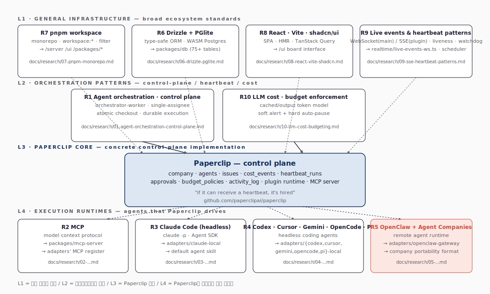
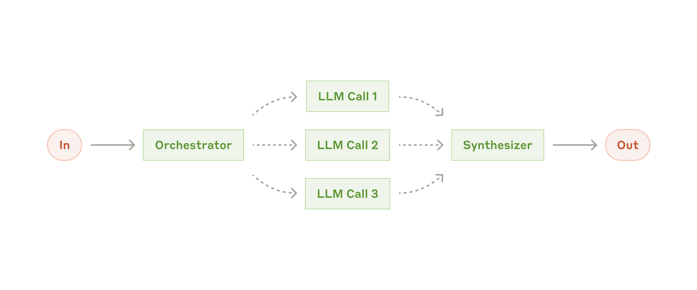
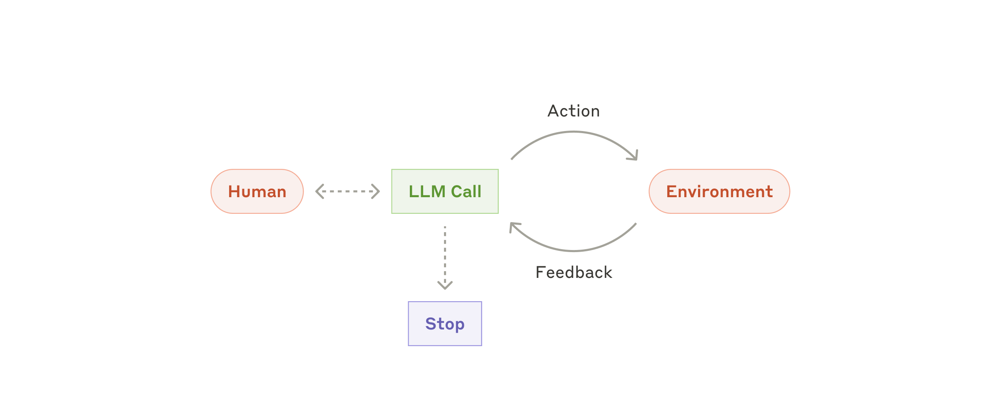
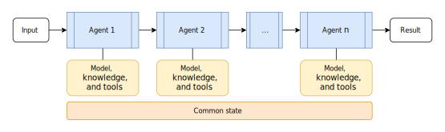
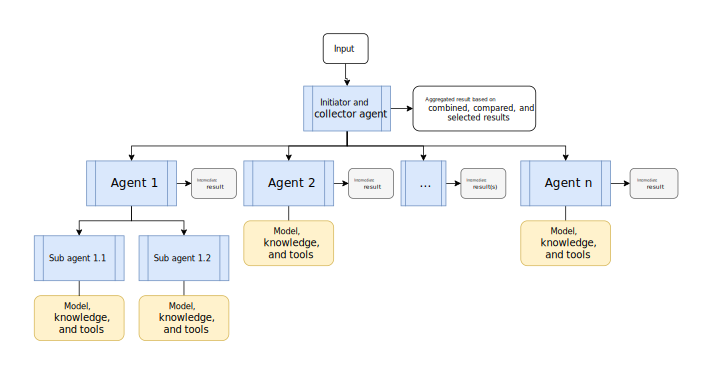
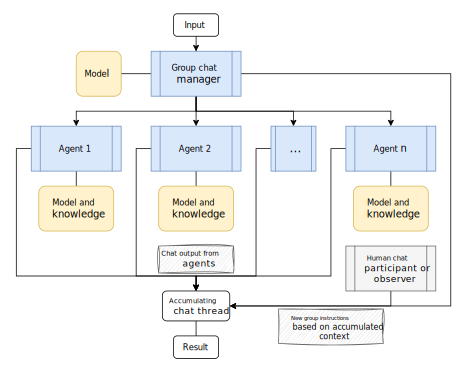
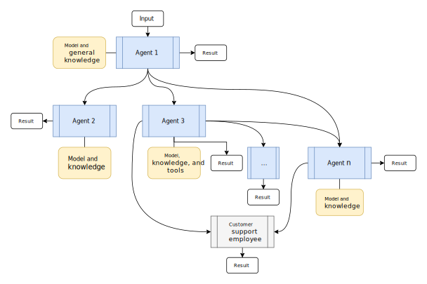
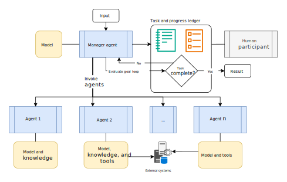

# Research Map — 10편의 리서치로 본 Paperclip의 기술적 좌표

## 1. 4-층 위계

리서치 10편은 Paperclip 본체를 둘러싼 **4개의 동심층** 으로 정렬할 수 있다 — 가장 바깥의 *일반 인프라 표준* (R6\~R9) → *오케스트레이션 패턴* (R1, R10) → *Paperclip 코어* (이 리포트의 본체) → *실행 런타임* (R2\~R5). 그림 10이 그 위계를 한 페이지로 보여 준다.

**그림 10. 리서치 ↔ Paperclip 4-층 위계 — 일반 인프라 표준 / 오케스트레이션 패턴 / Paperclip 코어 / 실행 런타임**



그림 10은 두 방향으로 해석할 수 있다. (1) *밖에서 안으로* 보면 Paperclip의 모든 기능은 결국 *바깥 4개 층*에 정의된 표준/패턴/런타임의 조합이다. 즉 Paperclip은 *발명*이라기보다 *정합성 있는 통합*이다. (2) *안에서 밖으로* 보면 Paperclip 코어 한 줄을 바꿀 때 어느 외부 표준에 부딪히는지가 보인다. 예컨대 `cost_events`를 손대면 R10(LLM cost 모델)의 가정과 정합해야 하고, atomic checkout을 손대면 R1(orchestration control plane)의 패턴과 정합해야 한다.

이 위계는 학습 순서와도 같다. 외층은 *그 분야를 모르고도 Paperclip을 쓸 수 있는가*를 결정하는 도구들이고, 내층은 *Paperclip이 지금 무엇을 호출하고 있는가*를 결정하는 런타임이다.

## 2. 리서치 ↔ Paperclip 모듈 일대일 매핑

**표 1. 리서치 ↔ Paperclip 매핑**

| # | 리서치 | 다루는 영역 | Paperclip의 대응 위치 |
|---|---|---|---|
| R1 | [Agent orchestration / control plane](../research/01-agent-orchestration-control-plane.md) | orchestrator-worker · single-assignee · atomic checkout · durable execution | SPEC §8 atomic checkout, services/recovery/*, doc/execution-semantics.md |
| R2 | [Model Context Protocol](../research/02-model-context-protocol.md) | host/client/server · transport · tools/resources/prompts | packages/mcp-server, adapters/*-local의 MCP 등록 |
| R3 | [Claude Code (headless)](../research/03-claude-code-cli.md) | `claude -p` · stream-json · Agent SDK · skills | packages/adapters/claude-local |
| R4 | [Codex · Cursor · Gemini · OpenCode · Pi](../research/04-headless-coding-agents.md) | 헤드리스 코딩 에이전트의 공통 계약 | packages/adapters/{codex,cursor,gemini,opencode,pi}-local |
| R5 | [OpenClaw + Agent Companies](../research/05-openclaw-agent-companies.md) | 원격 에이전트 런타임 · 회사 패키지 포맷 | packages/adapters/openclaw-gateway, services/company-portability.ts (180 KB) |
| R6 | [Drizzle + PGlite](../research/06-drizzle-pglite.md) | 타입-안전 ORM · 임베디드 Postgres | packages/db/* (80+ 테이블 · 마이그레이션) |
| R7 | [pnpm workspace](../research/07-pnpm-monorepo.md) | content-addressable 스토어 · `workspace:*` · filter | pnpm-workspace.yaml + 24개 워크스페이스 패키지의 분할 (adapters 9 · plugins · server · ui · cli 등) |
| R8 | [React + Vite + shadcn/ui](../research/08-react-vite-shadcn.md) | SPA · HMR · TanStack Query · 컴포넌트 분배 모델 | ui/* + Vite middlewareMode + 보드 UI 디자인 시스템 |
| R9 | [라이브 이벤트 & heartbeat patterns](../research/09-sse-heartbeat-patterns.md) | WebSocket(메인) / SSE(plugin bridge) · liveness · watchdog | `server/src/realtime/live-events-ws.ts` + heartbeat scheduler + startup/periodic reconciliation 7-pass (`server/src/index.ts:676-780`) |
| R10 | [LLM cost · budget](../research/10-llm-cost-budgeting.md) | cached input · 모델 가격 · soft alert · hard ceiling | cost_events 테이블 · budgets.ts (31 KB) · budget_incidents |

표 1은 두 방향으로 활용할 수 있다. (1) *역방향* — Paperclip의 한 모듈(예: `services/heartbeat.ts`)을 읽다가 막히면, 표의 *Paperclip 모듈/파일* 열에서 그 모듈을 찾아 관련 외부 패턴으로 이동한다. (2) *순방향* — R1\~R10 리서치를 읽은 뒤 *Paperclip 모듈/파일* 열을 따라 코드베이스를 탐색하면 *어떤 표준이 어느 구현에 연결되는지*가 한 번에 매핑된다. 표 1의 행 순서는 *외부 인프라(R6\~R9) → 오케스트레이션 패턴(R1, R10) → 실행 런타임(R2\~R5)*으로, 그림 10의 4-층 위계와 같은 순서다.

## 3. 외부 표준 다이어그램으로 본 Paperclip의 좌표

### 3.1 Anthropic의 4가지 패턴

Anthropic의 *"Building Effective Agents"* (Schluntz & Zhang)가 정의한 4가지 빌딩 블록이 Paperclip 어디에 대응되는지 본다.

그림 10-1 (Augmented LLM) 은 도구·리트리벌·메모리를 가진 단일 LLM 이다. Paperclip의 *한 명의 에이전트 안*에서 일어나는 일이며, Paperclip 자체는 이 블록을 정의하지 않고 어댑터에 위임한다.

**그림 10-1. Augmented LLM (출처: Anthropic — Building Effective Agents)**


그림 10-2 (Orchestrator-workers) 는 한 LLM 이 작업을 분해해 다른 LLM 워커들에 분배·종합하는 패턴이다. **이 블록이 곧 Paperclip의 "회사" 모델** 로, CEO가 분해하고, 보고 라인이 워커가 되며, control plane이 분배·종합 인프라가 된다.

**그림 10-2. Orchestrator-workers (출처: Anthropic — Building Effective Agents)**



그림 10-3 (Evaluator-optimizer) 은 한 LLM 이 다른 LLM 의 결과를 평가·반복하는 패턴이다. Paperclip에서는 `in_review` 상태가 이 패턴의 표면이며, 보드/리뷰 에이전트가 evaluator 역할을 한다.

**그림 10-3. Evaluator-optimizer (출처: Anthropic — Building Effective Agents)**


그림 10-4 (Autonomous agent) 는 환경과의 피드백 루프 안에서 장기 실행되는 에이전트다. heartbeat가 그 루프의 외부 클럭이며, watchdog · stranded recovery가 *길게 살아남는 에이전트*의 손상에 대응한다.

**그림 10-4. Autonomous agent (출처: Anthropic — Building Effective Agents)**



### 3.2 Microsoft Azure의 5가지 오케스트레이션 패턴

Microsoft Learn의 *AI agent design patterns* 문서가 정리한 5개 오케스트레이션 패턴 — Sequential / Concurrent / Group-chat / Handoff / Magentic — 도 Paperclip의 표현력 안에 있다.

**그림 10-5. Sequential (출처: Microsoft Learn)**



**그림 10-6. Concurrent (출처: Microsoft Learn)**



**그림 10-7. Group-chat (출처: Microsoft Learn)**



**그림 10-8. Handoff (출처: Microsoft Learn)**



**그림 10-9. Magentic (출처: Microsoft Learn)**



**Paperclip 표현법** 으로 옮기면 다음과 같다.

- **Sequential**: 부모 → 자식 이슈 사슬 + blockers 로 순서 강제.
- **Concurrent**: 동일 부모 아래 sibling 이슈를 다수 에이전트에 할당.
- **Group-chat**: 같은 이슈 thread의 다중 댓글 + `issue_thread_interactions`.
- **Handoff**: `in_review` 핸드오프 + 다른 에이전트로 reassign.
- **Magentic** (planner + workers): CEO/PM 에이전트가 이슈 트리를 *동적으로* 분해.

이 매핑은 "표현 가능하다"는 주장이지 "완전히 같은 의미로 구현된다"는 뜻은 아니다. Paperclip은 group-chat을 별도 채팅방으로 만들지 않고 이슈 댓글과 thread interaction으로 흡수한다. 이 선택은 감사 가능성을 높이지만, 자유로운 실시간 대화 UX는 약해진다. Handoff도 마찬가지다. Paperclip의 핵심 원칙은 single assignee이므로, handoff는 동시 공동 작업이 아니라 책임자를 바꾸는 명시적 전이로 표현된다. Concurrent 패턴도 sibling issue를 여러 에이전트에게 나누는 방식이지, 하나의 issue를 여러 에이전트가 동시에 붙잡는 방식이 아니다.

**표 2. 외부 오케스트레이션 패턴을 Paperclip으로 옮길 때의 손실과 이득**

| 패턴 | Paperclip 표현 | 얻는 것 | 잃는 것 |
|---|---|---|---|
| Sequential | blocker + parent/child issue | 순서와 감사 이력 | 즉흥적인 단계 재배열의 자유도 |
| Concurrent | sibling issue 다중 할당 | 병렬 실행과 비용 분리 | 한 작업을 여러 명이 동시에 편집하는 모델 |
| Group-chat | issue comments + thread interactions | 대화가 작업 객체에 붙음 | Slack식 독립 채널 UX |
| Handoff | assignee 변경 + `in_review` | 책임자 추적 | 느슨한 공동 소유 |
| Magentic | CEO/PM이 issue tree 생성 | 계획이 데이터 모델에 남음 | 완전 자율 planner의 임의성 |

> 즉 Paperclip은 새로운 패턴을 발명하지 않고, 기존 5\~6가지 표준 패턴을 **이슈 트리 + heartbeat + 단일 assignee + 댓글**이라는 4-tuple 위에 올린다. 그 과정에서 일부 UX 자유도를 잃는 대신, 비용 귀속·감사·회복 규칙을 얻는다.

## 4. 어디까지가 *Paperclip의 발명*인가

위 매핑이 보여 주는 핵심 통찰은 다음과 같다 — Paperclip은 *기술*보다는 *정합성*의 발명이다.

- **데이터 모델로 동시성을 푼다** — atomic checkout, single assignee, monthly budget 윈도우.
- **자동화의 한계를 명시한다** — *"Paperclip reports problems, it doesn't silently fix them"* 한 줄로 회복 정책의 모든 모서리가 결정된다.
- **회사를 1급 객체로** — 비용·거버넌스·작업이 모두 같은 스코프에서 흐르므로, 별도 BI 도구 없이도 *"회사가 돌고 있나"* 라는 질문에 답할 수 있다.
- **어댑터 계약의 단순함** — 장기 SPEC 의 `invoke/status/cancel` 3-method 계약(`doc/SPEC.md:207-215`) + 현재 구현의 `ServerAdapterModule.execute` / `testEnvironment` 2 필수 메서드(`packages/adapter-utils/src/types.ts:349-431`) + adapter package 의 4 진입점(`.` / `./server` / `./ui` / `./cli`, `packages/adapters/claude-local/package.json:15-20`) 조합으로 새 런타임을 첨가하는 비용을 작게 유지한다.

## 5. 검증 시나리오

다음 실험은 리포트의 주요 주장을 한 사이클 안에서 확인하는 최소 시나리오다. **코드 1**은 그 *7단계 한 사이클*이다 — 클론에서 시작해 한 회사를 돌려 보고, hard limit을 일부러 트리거해 보드 거버넌스가 어떻게 동작하는지를 *체험*하는 것이 핵심.

**코드 1. 검증 시나리오 — 7단계 한 사이클**

```bash
# 1) 클론·실행
git clone https://github.com/paperclipai/paperclip.git && cd paperclip && pnpm install && pnpm dev

# 2) /companies 에서 회사 만들고
# 3) /agents/new 에서 CEO(claude_local) 1명만 만들고
# 4) /goals 에서 사소한 골 1개 등록하고
# 5) /dashboard/live 에서 한 사이클을 실제로 실행

# 6) 동시에 /approvals · /api/companies/<id>/costs/summary · activity_log 확인
# 7) hard limit을 낮게 잡아 auto-pause 트리거 확인
```

이 한 사이클은 README와 `doc/SPEC.md`, 그리고 이 리포트가 문장만으로는 제공하지 못하는 *체험*의 마지막 한 조각을 제공한다.

## 6. 닫는 한 줄

> Paperclip 은 단일 신기술이 아니라 *5\~6개 표준 도구를 한 군데에 정합적으로 묶은 것* 이다. 그 정합성이 곧 가치이며, 이 리포트의 10편 리서치가 그 정합의 외부 좌표를 표시한다.
