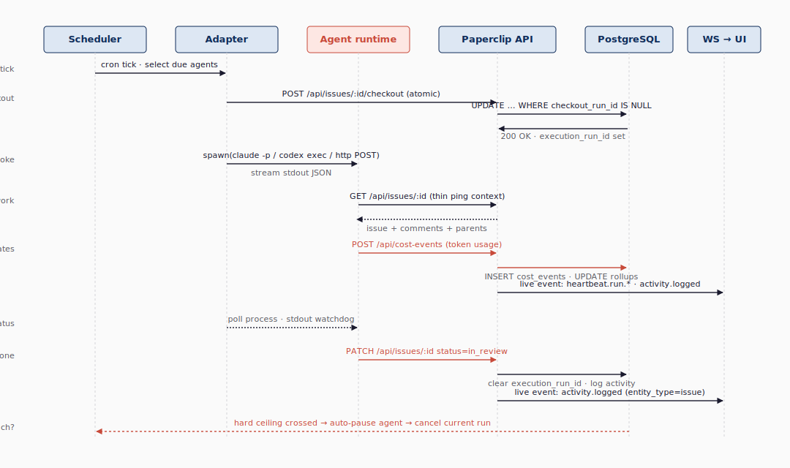
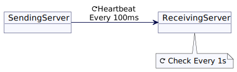
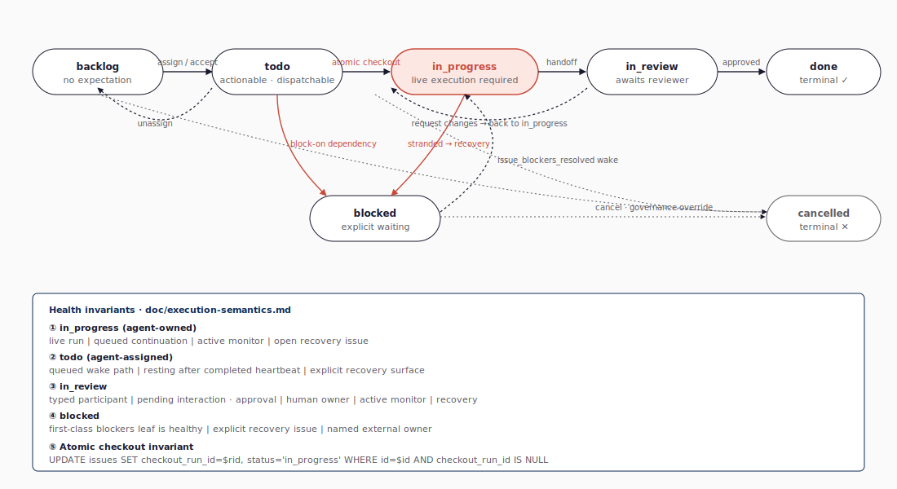

# Runtime Execution — Heartbeat · Checkout · Watchdog

## 1. 한 회차의 heartbeat가 만드는 일들

Paperclip의 실행 의미론은 한 가지 단순한 그림으로 압축된다 — **scheduler/wake claim → server-side atomic checkout → adapter.execute → agent runs → cost report → live event push** 의 직선이다. 그림 3-1이 6개 라이프라인(Scheduler · Adapter · Agent runtime · Paperclip API · PostgreSQL · WebSocket→UI) 위에 그 흐름을 시간 축으로 펼쳐 보여 준다.

**그림 3-1. heartbeat 한 회차의 시퀀스 — 6 라이프라인을 가로지르는 t₀\~t₆ 흐름**



t₀에 wake 큐가 만기 도래한 에이전트의 run을 클레임한다. t₁에 Paperclip server-side에서 atomic checkout이 이슈를 잡는다(`server/src/services/issues.ts:4588-4731`). t₂에 서버가 `adapter.execute(ctx)` 를 호출해 외부 에이전트(Claude Code, Codex, OpenCode 등)를 spawn한다. t₃부터 에이전트는 thin ping으로 받은 컨텍스트를 가지고 일을 한다. t₄에 토큰 사용량이 cost event로 들어와 회사·에이전트·이슈 차원으로 롤업되고, 이 변화는 회사 단위 WebSocket 라이브 채널(`activity.logged` · `heartbeat.run.*`)로 보드 UI에 즉시 반영된다. t₆에 결과가 `in_review`로 핸드오프되고 실행 락(`execution_run_id`)이 해제된다 — 오너십 락(`checkout_run_id`)은 별도 회복 규칙에 따라 유지·해제된다. 만약 어디서든 예산 한도를 넘으면 t∞의 빨간 점선처럼 모든 흐름이 가로채진다. 그림 3-1의 핵심 관찰점은 두 가지다. (1) 시간 축이 **단조 증가**하므로 한 라이프라인 안에서 동시 실행이 일어나지 않는다. 이는 atomic checkout이 *데이터 모델 차원의 직렬화*로 동작한다는 시각적 증거다. (2) 빨간 t∞ 점선은 *어떤 t에서도 가로지를 수 있다*. 예산 가드는 별도 라인이 아니라 모든 단계 위에 떠 있는 *교차 절단(cross-cut) 게이트*다. 이 두 성질이 합쳐져 "한 회차는 결정론적이지만 회사 안전장치는 항상 우선한다"는 실행 모델이 성립한다.

## 2. Heartbeat의 정의 — 일반 분산 패턴 한 컷

이 그림이 새로 발명한 것은 거의 없다. 분산 시스템에서 heartbeat 는 오랜 패턴이다. **그림 3-1-A** 는 Martin Fowler 의 *Patterns of Distributed Systems* 시리즈가 정리한 HeartBeat 패턴 — 서버가 주기적인 신호로 자신의 생존을 외부에 알리는 모델 — 의 공식 다이어그램이다.

**그림 3-1-A. HeartBeat 패턴 (출처: martinfowler.com/articles/patterns-of-distributed-systems/heartbeat.html)**



Paperclip 이 비튼 점은 두 가지다. (1) 에이전트가 보내는 heartbeat 가 아니라 **Paperclip 이 에이전트에게 보내는 wake 신호** 다. (2) 한 회차의 wake 가 곧 한 회차의 작업 사이클이고, 그 사이클의 출발 시점에 atomic checkout 이 강제된다. 자세한 패턴 비교는 [docs/research/09-sse-heartbeat-patterns.md](../research/09-sse-heartbeat-patterns.md) 에서 다룬다.

## 3. 어댑터 계약 — 장기 SPEC과 현재 구현 두 층

어댑터 계약은 두 층으로 봐야 한다. 장기 SPEC(`doc/SPEC.md:207-215`)은 3-메서드(`invoke / status / cancel`)를 최소 인터페이스로 그리지만, 현재 구현의 `ServerAdapterModule`(`packages/adapter-utils/src/types.ts:349-352`)에서 *필수* 메서드는 두 개 — `execute(ctx)` 와 `testEnvironment(ctx)` — 다. 나머지는 옵션이다. 코드 1이 두 층을 한눈에 보여 준다.

**코드 1. 어댑터 계약 — SPEC vs 현재 구현**

```ts
// 장기 SPEC (doc/SPEC.md:207-215)
invoke(agentConfig, context?) => void           // start a cycle
status(agentConfig)           => AgentStatus    // running/finished/errored
cancel(agentConfig)           => void           // graceful stop

// 현재 구현 (packages/adapter-utils/src/types.ts:349-389)
interface ServerAdapterModule {
  execute(ctx: AdapterExecutionContext): Promise<AdapterExecutionResult>;   // 필수
  testEnvironment(ctx: AdapterEnvironmentTestContext): Promise<AdapterEnvironmentTestResult>;  // 필수
  // listSkills / syncSkills / sessionCodec / models / getQuotaWindows / detectModel ... 모두 옵션
}
```

런타임은 `adapter.execute(ctx)` 로 들어간다(`server/src/services/heartbeat.ts` 의 invocation 경로). **이 작은 표면이 multi-runtime 지원의 비밀** 이다 — Python 스크립트, Claude Code, Codex CLI, OpenClaw 게이트웨이 모두 두 필수 메서드만 구현하면 된다. 비용 보고나 작업 상태 갱신은 어댑터 인터페이스에 들어 있지 않다 — 그것은 **에이전트가 Paperclip REST API 를 호출** 해서 한다. 그 API 콜은 어댑터 종류와 무관하다. 즉 어댑터는 *어떻게 실행을 시작·검증하느냐* 만 정의하고, 도메인 작업은 통일된 API 표면에서 일어난다.

## 4. 7-state issue state machine

이슈는 7개 상태를 가진다. **그림 3-2** 가 그 전체 전이망과 회복 규칙을 한 페이지로 보여 준다.

**그림 3-2. 이슈 7-state state machine — 정상 전이와 회복 경로**



전이의 핵심은 다음과 같다.

- `backlog` → `todo`: 보드/CEO 가 일을 살리는 행위
- `todo` → `in_progress`: **반드시 atomic checkout** 을 거쳐야 한다
- `in_progress` → `in_review`: 결과 핸드오프
- `todo` → `blocked` 또는 `in_progress` → `blocked`: blocker 선언, 또는 stranded recovery / watchdog 격상이 실행·대기 실패를 `blocked` 로 표면화한다(`doc/SPEC-implementation.md:421-426`).
- `blocked` → `in_progress`: 마지막 blocker가 `done`이 되면 `issue_blockers_resolved` wake가 큐잉되고, 그 wake가 fire한 run의 checkout이 성공할 때 비로소 전환된다 — DB 상태가 *즉시 자동* 전이되는 것이 아니다.
- `→ cancelled`: 거버넌스 종료. terminal state는 `done` / `cancelled` 둘뿐이며, `cancelled` 진입은 V1 전이표가 명시한 비종료 상태에서만 허용된다.

`doc/execution-semantics.md` §7 이 강조하는 **liveness 계약** 은 다음과 같이 요약된다 — "에이전트 소유 비종료 이슈는, 누군가가 다음 행동의 책임자이고 그를 깨울 경로가 있어야 한다." 그림 3-2 의 하단 노트박스가 상태별 필요·충분 회복 경로(active run / queued continuation / typed participant / pending interaction / monitor / human owner / first-class blocker leaf / **explicit recovery action**) 를 정리한다. 학습자가 그림에서 *놓치기 쉬운 디테일* 두 가지를 짚어 둔다. 첫째, `cancelled` 는 *terminal state* 라서 일단 진입하면 다시 나가지 않는다(`done → cancelled` 같은 전이는 V1 전이표가 허용하지 않는다). 진입은 V1 전이표가 명시한 비종료 상태에서만 다루며, 이를 통해 거버넌스 종료(보드의 hard stop) 가 모든 회복 규칙을 우회한다. 둘째, `blocked` 의 해제는 *자동 즉시 전이* 가 아니라 *wake + checkout 성공* 의 2단계다 — 이 비대칭이 §8 의 보수적 회복과 함께 동작해 회복 경로의 일관성을 유지한다.

## 5. checkout vs execution — 두 ID의 분리

`issues.checkout_run_id` 와 `issues.execution_run_id` 가 분리된 이유는 다음 표가 가장 명료하다.

**표 1. 두 ID 의 분리 이유**

| 컬럼 | 의미 | 예시 |
|---|---|---|
| `checkout_run_id` | **오너십 락** — 누가 지금 이 이슈를 잡고 있는가 | 에이전트 X 가 잡았고, 다음 wake 도 X 에게 가야 함 |
| `execution_run_id` | **현재 라이브 실행** — 지금 살아 있는 run 의 ID | X 의 이전 run 은 죽었지만 락은 여전히 X. 새로 wake 가 들어오면 새로운 execution_run_id 를 채운다 |

표 1 의 두 컬럼이 *둘 다* 있어야 보수적 회복이 작동한다 — `checkout_run_id` 만 있으면 죽은 run 도 영원히 락을 잡고 있는 셈이고, `execution_run_id` 만 있으면 *누구의 작업이었는지* 의 기억이 사라진다. 이 분리 덕분에 startup recovery 시 *"오너는 X 가 맞지만, 살아 있는 실행은 사라졌다. 같은 X 에게 한 번 더 wake 를 보내자"* 같은 정확한 회복이 가능하다. 그림 3-2 에서 `in_progress` 노드가 *자기 자신* 으로 돌아오는 작은 화살표는 이 *같은 X 에게 한 번 더* 의 시각적 표현이다.

## 6. Stranded recovery — 보수적 한 번 재시도

`doc/execution-semantics.md` §8 은 두 가지 stranded 패턴을 정의한다.

- **Stranded `todo` (8.1)**: `todo` 상태에서 dispatch wake 가 죽고 큐에 남은 wake 도 없는 경우.
- **Stranded `in_progress` (8.2)**: `in_progress` 상태에서 라이브 run 이 사라지고 큐에 continuation 도 없는 경우.

회복 규칙은 동일하게 보수적이며 *2단계* 다. **1단계**: 자동으로 한 번만 wake 를 재큐잉한다. **2단계**: 그 회차가 또 stranded 로 끝나면 이슈를 `blocked` 로 옮기고, source-scoped `issue_recovery_actions` 행을 upsert한다(`packages/db/src/schema/issue_recovery_actions.ts:16-67`, `server/src/services/issue-recovery-actions.ts:1-295`). 활성(`active` · `escalated`) recovery action은 source issue당 하나로 제한되고(`packages/db/src/schema/issue_recovery_actions.ts:61-63`), 같은 source issue 안에서는 `(cause, fingerprint)` 조합으로 중복 upsert를 막는다(`:64-66`). `owner_*` / `wake_policy` / `monitor_policy` 컬럼으로 *누가 다음에 무엇을 해야 하는가* 를 명시한다. 절대 *다른* 에이전트로 재할당하지 않는다. 이는 §12 가 명시한 의도다 — "preserve ownership / retry once / create explicit recovery action / escalate visibly."

## 7. Silent active-run watchdog

라이브 process 가 *살아 있어 보이지만 출력이 멈춘* 경우는 별도의 회로가 잡는다. recovery 서비스가 다음 5개 분류로 silence 를 라벨링한다 — `ok`, `suspicious`, `critical`, `snoozed`, `not_applicable`. 신호는 *recovery action* 으로 표면화되며, issue-backed 평가가 필요한 경우 `stale_active_run_evaluation` 이슈를 만든다. `suspicious` 는 medium-priority evaluation으로, `critical` 은 high-priority 로 격상되면서 원본 이슈를 평가 작업에 block 한다. 이 흐름의 의도된 결과는 — *프로세스를 함부로 죽이지 않으면서, 보드와 회복 오너에게 evaluation 으로 드러내는 것* — 다음 두 줄에 압축된다.

> "Suspicious silence creates a medium-priority review issue. Critical silence raises that review issue to high priority and blocks the source issue on the explicit evaluation task without cancelling the active process." — `doc/execution-semantics.md` §10

`continue` · `snooze` · `dismissed_false_positive` 세 가지 결정만 합법이며, 결정 권한은 보드 또는 평가 이슈의 assignee 에게만 있다.

## 8. Startup reconciliation — 7단계

API 서버가 부팅되면 startup/periodic reconciliation 이 결정론적 순서로 돈다(`server/src/index.ts:676-780`). 코드 2 가 그 순서다 — stranded assigned work reconciliation 과 silent active-run watchdog 은 서로 다른 실패 모드(공식 dispatch가 죽은 경우 vs 라이브 run이 살아 보이지만 출력이 멈춘 경우)를 *순서대로* 다룬다.

**코드 2. 부팅 시 startup reconciliation 순서**

```text
1. reap orphan `running` runs
2. promote due scheduled retries
3. resume persisted `queued` runs
4. reconcile stranded assigned work (§8.1, §8.2)
5. reconcile issue-graph liveness
6. scan silent active runs (§10 — recovery action으로 표면화)
7. reconcile productivity reviews
```

이 결정론적 순서가 "재부팅이 운영자의 인지를 흩뜨리지 않는다" 는 약속의 기반이다.

## 9. heartbeat가 *아닌* 것들

마지막으로, 안티 정의가 중요하다.

- **고정 빈도 cron 이 아니다**: 실제로는 큐에 쌓인 wake 와 monitor next-check-at 으로 트리거된다.
- **어댑터 상태 폴링이 아니다**: 현재 구현은 별도 `status()` 메서드 대신 `heartbeat_runs.status`, process metadata, output event, `adapter.execute` 결과, watchdog evidence를 조합해 liveness를 판단한다(`packages/db/src/schema/heartbeat_runs.ts:14-40`). 출력 silence 가 진짜 평가 신호다.
- **자동 재할당이 아니다**: 누가 잡았는가 는 회복을 거치며 보존된다.
- **자동 완료가 아니다**: prose 코멘트로 done 을 추론하지 않는다.

이 보수적 입장이 §12의 결론이다. [04-adapters-and-skills.md](04-adapters-and-skills.md)는 이 실행 골격을 채우는 built-in 어댑터와 skills 시스템을 분석한다.
